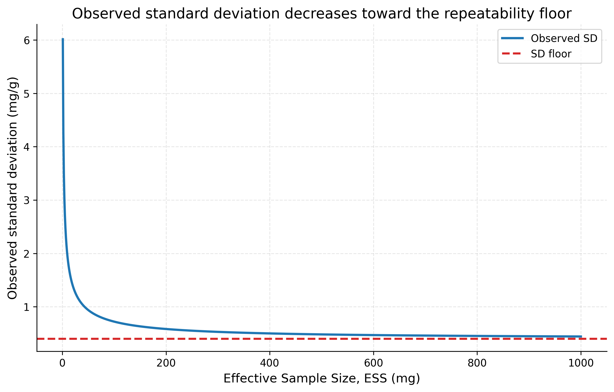
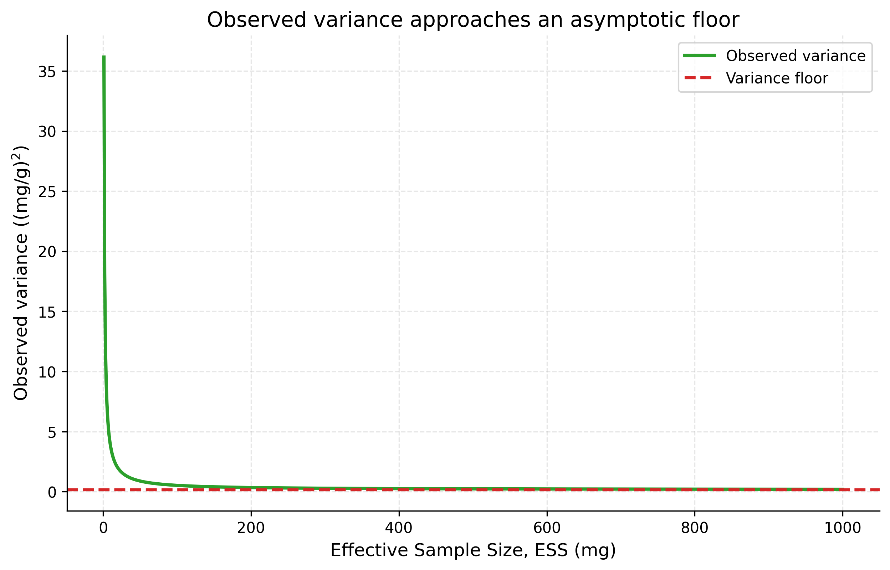
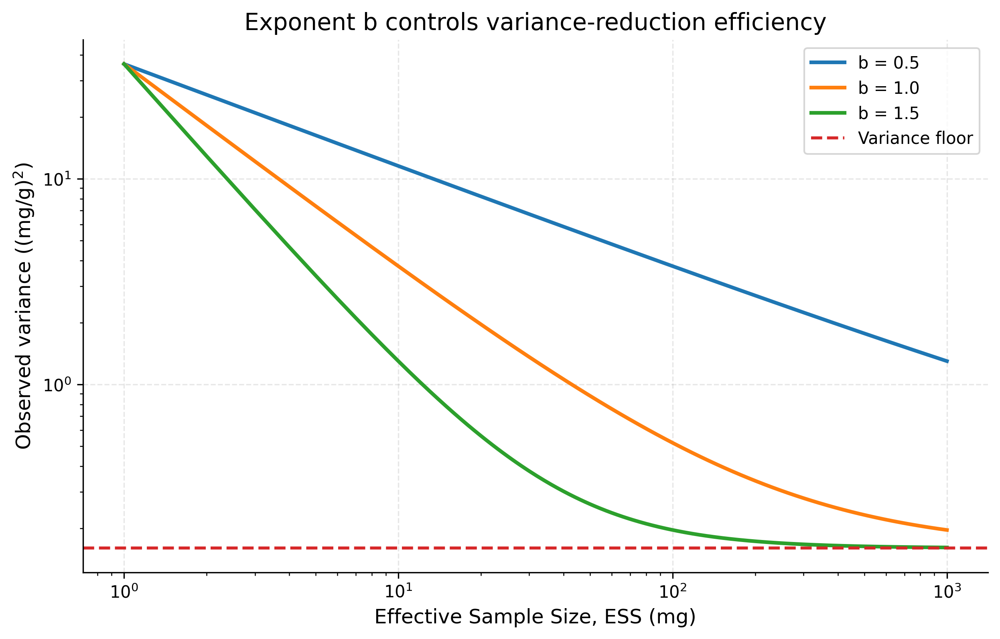
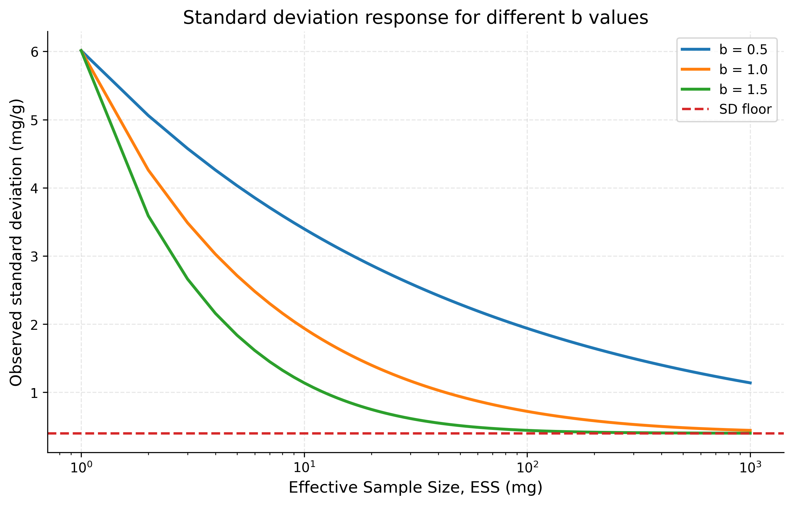
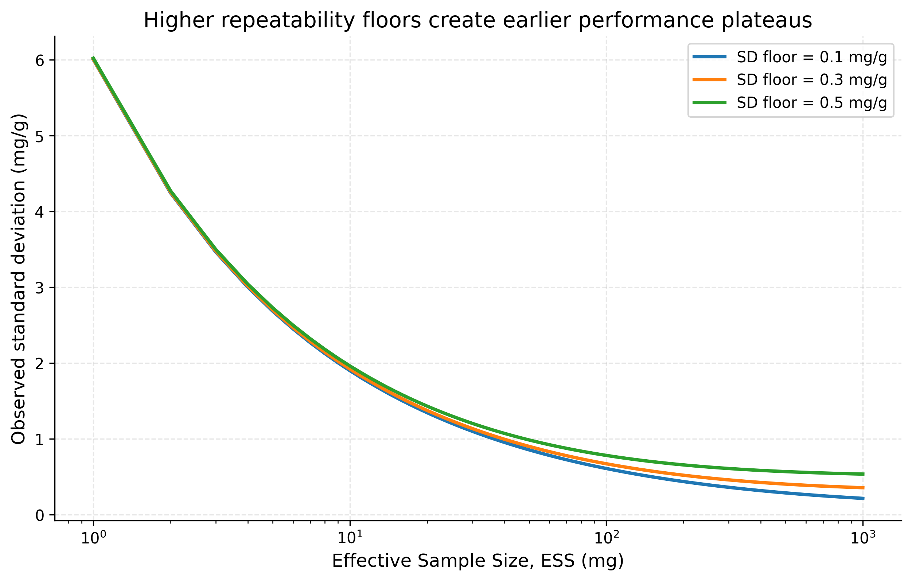
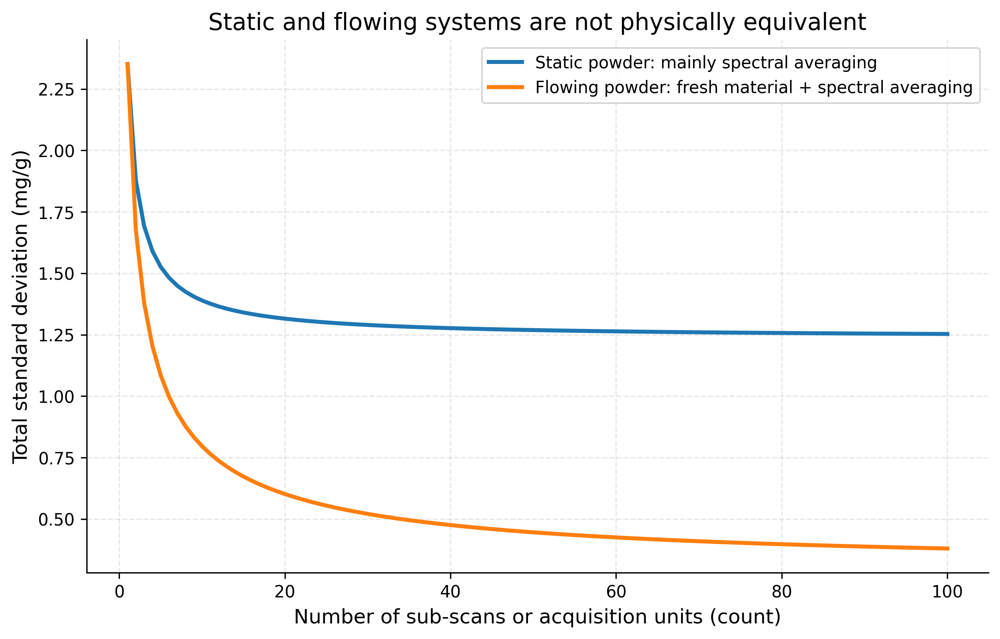
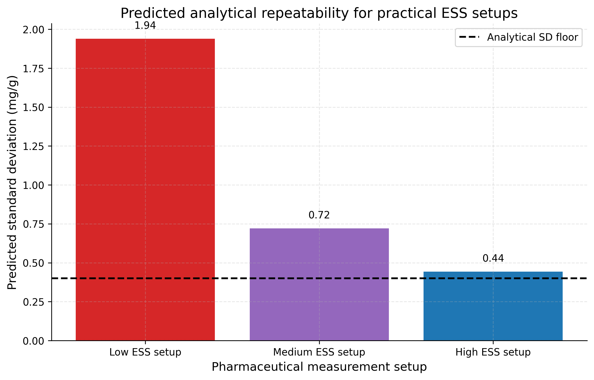

# Expanded Variance Model for Effective Sample Size (ESS)

Setup: expanded_variance_model

Report timestamp: 20260512_135145

Source notebook: expanded_variance_model_ESS.ipynb

## Executive summary

This report explains and simulates the expanded ESS variance equation for PAT and NIR powder measurements. The model separates an irreducible analytical variance floor from an ESS-dependent sampling variance term, thereby clarifying why increased representativity improves repeatability at low ESS but eventually reaches a plateau.

## Key parameters

- ESS range (mg): 1 to 1000
- Variance floor ((mg/g)^2): 0.16
- SD floor (mg/g): 0.4
- Sampling heterogeneity constant k: 36
- Default exponent b: 1
- b values compared: 0.5, 1, 1.5
- Variance-floor SD values compared (mg/g): 0.1, 0.3, 0.5
- Results folder: results\expanded_variance_model

## Scientific Background

Effective Sample Size is a practical bridge between physical sampling theory and optical PAT measurement design. In NIR analysis of powders, the numerical value of a spectrum is not determined only by the chemical concentration in the bulk lot. It is also influenced by how much material is optically interrogated, whether the interrogated particles are representative of the lot, how many independent particle configurations enter the measurement, and how much instrumental or chemometric noise remains after averaging.

For a heterogeneous particulate material, a small optical sampling volume may over-represent a local cluster of high- or low-concentration particles. Increasing the effective amount of independently sampled material reduces this random heterogeneity contribution. Real instruments also have repeatability limits: detector noise, lamp fluctuations, probe contact, optical scattering variation, model residuals, and reference-method uncertainty produce a residual variance that does not disappear merely because the optical sampling volume is made larger.
## Expanded Variance Equation

The model used throughout this notebook is:

$$
\sigma_{\mathrm{obs}}^2 = \sigma_{\mathrm{floor}}^2 + \frac{k}{\mathrm{ESS}^{b}}
$$

For ideal independent sampling, variance is expected to scale inversely with the effective number or mass of independent increments:

$$
\sigma^2 \propto \frac{1}{\mathrm{ESS}}
$$

Taking the square root gives the standard deviation relationship:

$$
\sigma \propto \frac{1}{\sqrt{\mathrm{ESS}}}
$$

The square-root relationship is why very large increases in sampled mass are required to obtain modest improvements once the system is already in the low-variance region.
## Physical Meaning of All Variables

| Symbol | Meaning | Physical meaning | Unit |
|---|---|---|---|
| $\sigma_{\mathrm{obs}}^2$ | Observed variance | Total measured variance of repeated predictions or assays | $(\mathrm{mg/g})^2$ |
| $\sigma_{\mathrm{obs}}$ | Observed standard deviation | Repeatability expressed on the concentration scale | $\mathrm{mg/g}$ |
| $\sigma_{\mathrm{floor}}^2$ | Irreducible variance floor | Residual variance from repeatability, instrument noise, model error, and other non-sampling effects | $(\mathrm{mg/g})^2$ |
| $\sigma_{\mathrm{floor}}$ | Irreducible standard deviation floor | Minimum attainable standard deviation under the model | $\mathrm{mg/g}$ |
| $\mathrm{ESS}$ | Effective Sample Size | Effective independently represented sample mass or equivalent sampled material basis | $\mathrm{mg}$ |
| $k$ | Sampling heterogeneity constant | Scale factor for variance generated by particulate heterogeneity at low ESS | variable, commonly $(\mathrm{mg/g})^2\,\mathrm{mg}^{b}$ |
| $b$ | ESS exponent | Describes how efficiently variance decreases as ESS increases | dimensionless |
| $\sigma_{\mathrm{sampling}}^2$ | Sampling variance | Variance contribution from finite powder representativity | $(\mathrm{mg/g})^2$ |
| $\sigma_{\mathrm{instrument}}^2$ | Instrument variance | Variance contribution from spectral or instrumental repeatability | $(\mathrm{mg/g})^2$ |
| $n_{\mathrm{scan}}$ | Number of sub-scans | Number of spectra or sub-scans averaged into one analytical result | count |
## Connection to Theory of Sampling (Gy)

Pierre Gy's Theory of Sampling states that sampling error is controlled by the interaction between material heterogeneity and the sampling process. For particulate systems, the Fundamental Sampling Error decreases when a larger and more representative mass is collected, provided that increments are selected with correct probabilistic sampling principles and sufficiently independent particle inclusion.

The ESS model is not a full Gy equation. It is a compact empirical and mechanistic approximation that carries the same central scaling idea: increasing the effective number of independently represented particles reduces sampling variance. In the idealized limit where each increment is independent and identically distributed:

$$
\mathrm{Var}(\bar{x}) = \frac{\sigma_{\mathrm{particle}}^2}{n}
$$

If effective sample mass is proportional to the number of independent particle-scale increments, then:

$$
n \propto \mathrm{ESS}
$$

and therefore:

$$
\mathrm{Var}(\bar{x}) \propto \frac{1}{\mathrm{ESS}}
$$

This is the theoretical basis for expecting $b \approx 1$ in an ideal independent sampling regime. Deviations from $b=1$ indicate non-ideal representativity, correlated increments, segregation, flow structure, optical re-sampling of the same particles, or other departures from ideal sampling conditions.
## Variance Floor and NIR Repeatability

In real NIR measurement systems, the ESS-dependent sampling term is only one part of the total variance. Analytical repeatability imposes a floor:

$$
\lim_{\mathrm{ESS}\to\infty}\sigma_{\mathrm{obs}}^2 = \sigma_{\mathrm{floor}}^2
$$

The associated standard deviation limit is:

$$
\lim_{\mathrm{ESS}\to\infty}\sigma_{\mathrm{obs}} = \sigma_{\mathrm{floor}}
$$

This means that a measurement can be sampling-limited at low ESS and repeatability-limited at high ESS. Once the sampling term is small relative to $\sigma_{\mathrm{floor}}^2$, further increases in ESS have little practical effect on observed repeatability.
## Role of Effective Sample Size

ESS should be interpreted as an effective quantity, not merely a geometric volume or nominal mass. Two setups may have the same nominal mass in the optical field but different ESS if one system repeatedly observes the same particles while another system exposes fresh, independent material.

A useful decomposition is:

$$
\sigma_{\mathrm{total}}^2 = \sigma_{\mathrm{sampling}}^2 + \sigma_{\mathrm{instrument}}^2
$$

Increasing powder representativity primarily reduces $\sigma_{\mathrm{sampling}}^2$. Increasing spectral averaging primarily reduces $\sigma_{\mathrm{instrument}}^2$. A flowing system can reduce both if each additional scan observes fresh powder and also contributes to spectral averaging.
## Meaning of the Exponent b

The exponent $b$ controls how efficiently variance decreases with increasing ESS:

$$
\sigma_{\mathrm{sampling}}^2 = \frac{k}{\mathrm{ESS}^{b}}
$$

When $b \approx 1$, the system behaves like ideal independent averaging. Each proportional increase in ESS produces the theoretically expected proportional reduction in sampling variance. When $b < 1$, increasing ESS is less effective than ideal, often because scans are correlated, the same material is repeatedly sampled, segregation persists, or the optical geometry does not add independent increments efficiently. When $b > 1$, variance decreases faster than ideal over the modeled region, which may occur in a limited range if a design change improves both mass and independence, though such behavior should be interpreted cautiously.
## Two Different Routes for Increasing ESS

There are two physically different routes that are often both described as increasing ESS:

1. Increasing powder representativity by exposing more independent material to the measurement.
2. Increasing spectral averaging by collecting more sub-scans from the same or similar material configuration.

These routes are not physically equivalent. Powder representativity changes the particulate sampling basis. Spectral averaging improves instrumental precision, but if it repeatedly observes the same static particle arrangement it may not reduce the sampling error caused by local heterogeneity.
## Static versus Flowing Powder Systems

Static and flowing powder systems behave differently because the independence structure is different. In a static powder system, additional sub-scans may mainly reduce instrumental noise:

$$
\sigma_{\mathrm{instrument}}^2(n_{\mathrm{scan}}) = \frac{\sigma_{\mathrm{instrument},0}^2}{n_{\mathrm{scan}}}
$$

but the powder sampling term can remain nearly constant if the same particles stay in the optical field:

$$
\sigma_{\mathrm{sampling}}^2 \approx \mathrm{constant}
$$

In a flowing powder system, additional acquisition time can expose more independent material and reduce both terms:

$$
\sigma_{\mathrm{sampling}}^2(\mathrm{ESS}) = \frac{k}{\mathrm{ESS}^{b}}
$$

$$
\sigma_{\mathrm{instrument}}^2(n_{\mathrm{scan}}) = \frac{\sigma_{\mathrm{instrument},0}^2}{n_{\mathrm{scan}}}
$$

This is why flowing systems may show stronger repeatability gains with acquisition time than static systems, provided that flow is stable and representative.
## Simulation Framework

The simulations below use only `numpy`, `pandas`, and `matplotlib`. They implement the expanded variance model and save each figure as a high-resolution PNG in `results/expanded_variance_model/`. Tables are saved as CSV files in the same results folder and again in the timestamped report folder during export.
## Simulation Results

The following simulations progressively isolate the effect of ESS, the exponent $b$, the variance floor, and the distinction between powder representativity and spectral averaging.
## Simulation tables

Variable definitions used by the model:

| Symbol | Meaning | Unit |
| --- | --- | --- |
| sigma_obs^2 | Observed variance | (mg/g)^2 |
| sigma_floor^2 | Irreducible variance floor | (mg/g)^2 |
| ESS | Effective sample size | mg |
| k | Sampling heterogeneity constant | (mg/g)^2 mg^b |
| b | ESS exponent | dimensionless |
| n_scan | Number of sub-scans | count |

Practical pharmaceutical example:

| setup | ESS_mg | observed_variance_mg_g_sq | observed_sd_mg_g | interpretation |
| --- | --- | --- | --- | --- |
| Low ESS setup | 10 | 3.760 | 1.939 | Sampling-limited; local heterogeneity dominates repeatability. |
| Medium ESS setup | 100 | 0.520 | 0.721 | Transition region; both sampling and floor are important. |
| High ESS setup | 1000 | 0.196 | 0.443 | Near floor-limited; further ESS gains have diminishing returns. |
## Figures

The figures below are saved as high-resolution PNG files and embedded in the report.

## Sensitivity Analysis

The sensitivity analysis has two main conclusions. First, the exponent $b$ is a physically meaningful diagnostic, not just a curve-fitting coefficient. It reveals whether added ESS behaves like independent sampling. Second, the variance floor determines the best achievable precision.

The transition between sampling-limited and floor-limited behavior occurs approximately when:

$$
\frac{k}{\mathrm{ESS}^{b}} \approx \sigma_{\mathrm{floor}}^2
$$

Solving for ESS gives a characteristic transition scale:

$$
\mathrm{ESS}_{\mathrm{transition}} \approx \left(\frac{k}{\sigma_{\mathrm{floor}}^2}\right)^{1/b}
$$

Below this scale, increasing ESS is highly valuable. Above this scale, observed variance is increasingly controlled by the floor.
## Sensitivity summary table

| Quantity | Value | Unit |
| --- | --- | --- |
| Variance floor | 0.160 | (mg/g)^2 |
| SD floor | 0.400 | mg/g |
| Sampling heterogeneity constant k | 36.000 | (mg/g)^2 mg^b |
| ESS exponent | 1.000 | dimensionless |
| Approximate transition ESS | 225.0 | mg |
## Practical Implications for PAT

For PAT method development, the expanded ESS variance model encourages a disciplined separation between sampling representativity and analytical repeatability. Increasing the number of spectra is valuable, but it is not automatically equivalent to increasing powder representativity.

A robust PAT strategy should evaluate:

- whether powder motion brings fresh material into the optical sampling zone;
- whether flow rate, acquisition time, and probe geometry jointly determine ESS;
- whether the observed exponent $b$ is close to the independent-sampling expectation;
- whether the method has reached a repeatability floor where further ESS increases have little effect;
- whether static validation measurements understate or overstate the repeatability expected in a flowing process.
## Summary

The expanded ESS variance equation provides a compact model for understanding repeatability in NIR and PAT powder measurements:

$$
\sigma_{\mathrm{obs}}^2 = \sigma_{\mathrm{floor}}^2 + \frac{k}{\mathrm{ESS}^{b}}
$$

The model separates irreducible analytical variance from sampling variance. It explains why increasing ESS improves repeatability at low ESS, why improvements eventually plateau, and why the exponent $b$ carries physical information about sampling independence. For ideal independent sampling, $b \approx 1$ is theoretically expected because variance decreases in proportion to the number or mass of independent increments.
## References

- Gy, P. *Sampling for Analytical Purposes*. Wiley, 1998.
- Pitard, F. F. *Pierre Gy's Sampling Theory and Sampling Practice*. CRC Press, 1993.
- Esbensen, K. H. *Introduction to the Theory and Practice of Sampling*. IM Publications Open, 2020.
- Esbensen, K. H., and Románach, R. J. Representative sampling for process analytical technology and near-infrared spectroscopy in pharmaceutical manufacturing.
- Esbensen, K. H., Paasch-Mortensen, P., and colleagues. Theory of Sampling contributions on representative sampling, heterogeneity, and process sampling.
- Journal of Near Infrared Spectroscopy articles on representative sampling, powder heterogeneity, and NIR process analysis.
## Appendices

## Exported artifacts

CSV files

- simulation_01_ess_response.csv
- simulation_02_b_sensitivity.csv
- simulation_03_variance_floor_sensitivity.csv
- simulation_04_static_vs_flowing.csv
- simulation_05_practical_pharmaceutical_example.csv
- sensitivity_summary.csv

Figure files

- plot_01_observed_sd_vs_ESS.png
- plot_02_observed_variance_vs_ESS.png
- plot_03_variance_vs_ESS_by_b.png
- plot_04_sd_vs_ESS_by_b.png
- plot_05_sd_vs_ESS_by_variance_floor.png
- plot_06_static_vs_flowing_powder_systems.png
- plot_07_practical_pharmaceutical_example.png
