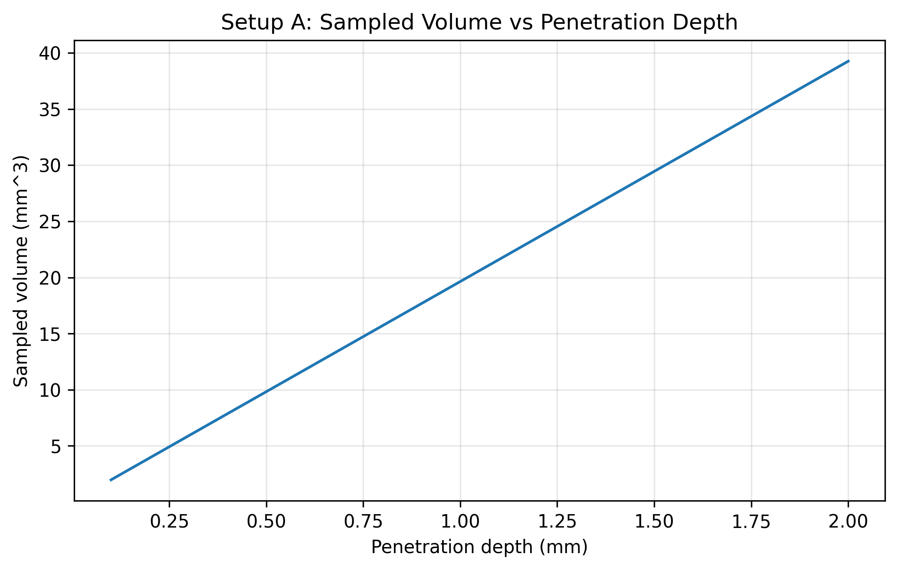
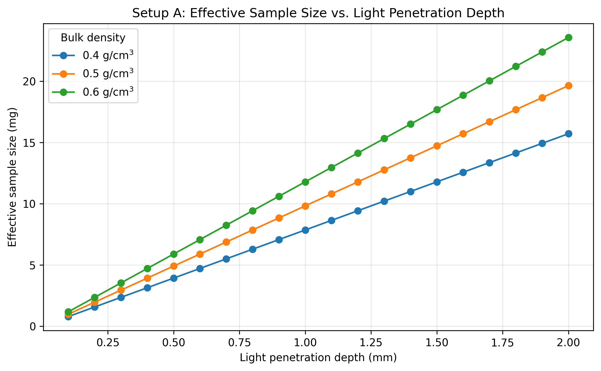

# Setup A Static Effective Sample Size Report

Setup: setup_a

Report timestamp: 20260422_101534

Source notebook: setup_A_static_effective_sample_size.ipynb

## Executive summary

Setup A is treated as a static optical sampling problem. The report uses a cylindrical first-order sampling-volume approximation to examine how penetration depth and bulk density set the effective sampled mass in a stationary powder bed. The main result is that effective sample size increases linearly with both penetration depth and density when illuminated area is fixed.

## Key parameters

- Probe diameter (mm): 5
- Penetration depth range (mm): 0.1 to 2.0
- Penetration depth step (mm): 0.1
- Bulk densities (g/cm^3): 0.4, 0.5, 0.6

## Background

Setup A represents a static powder bed measured with a contact or near-contact diffuse reflectance NIR probe. In this configuration, powder motion is neglected during acquisition, so the optical interaction zone can be approximated from probe geometry and effective penetration depth.

Effective sample size matters because it links measured spectral response to how much material actually contributes to the signal. This directly influences interpretation, robustness, and representativity.

A static powder bed is conceptually the simplest setup because dynamic transport and re-sampling effects are absent in the first approximation. The remaining challenge is optical interaction geometry.

It is important to distinguish the geometric interaction volume from the true optical sensitivity distribution. Real diffuse reflectance sampling is non-uniform with depth and lateral position. This notebook starts with a cylindrical approximation to provide a clear first-order model for sensitivity analysis and order-of-magnitude understanding.
## Objective

Simulate sampled volume and sampled mass for a 5 mm circular probe as a function of effective penetration depth from 0.1 mm to 2.0 mm, and examine the influence of powder bulk density.
## Theory

For a circular probe window:

$$A_{probe} = \pi\left(\frac{D_{probe}}{2}\right)^2$$

First-generation sampled volume approximation:

$$V_{sample} \approx A_{probe}\,d_{pen}$$

Sampled mass approximation:

$$m_{sample} = \rho_{bulk}\,V_{sample}$$

Symbols and units:

- $D_{probe}$: probe window diameter [m]
- $A_{probe}$: probe area [m$^2$]
- $d_{pen}$: effective penetration depth [m]
- $\rho_{bulk}$: bulk density [kg/m$^3$]
- $V_{sample}$: sampled volume [m$^3$]
- $m_{sample}$: sampled mass [kg]

This is a first-generation geometric approximation. The true optical sensitivity distribution is not perfectly cylindrical.
## Assumptions

- static powder bed
- uniform bulk density
- circular probe window
- uniform effective penetration depth
- cylindrical optical interaction volume approximation
- no particle motion during acquisition
- no resampling
- no detailed radiative transfer model yet
## Worked example

A representative worked example is shown for a penetration depth of 1.0 mm and a bulk density of 0.5 g/cm^3. This gives one concrete reference point before the full static sweep is interpreted.

| Quantity | Value | Unit |
| --- | --- | --- |
| Bulk density | 0.5 | g/cm^3 |
| Penetration depth | 1.0 | mm |
| Illuminated area | 0.1963 | cm^2 |
| Sampled volume | 0.0196 | cm^3 |
| Effective sample size | 9.8175 | mg |
## Model scenarios and sweep design

The static sweep varies only two quantities: penetration depth and bulk density. The illuminated area is fixed by probe geometry, so the report isolates how optical depth and density convert directly into sampled volume and sampled mass.

- penetration depth from 0.1 to 2.0 mm in 0.1 mm steps
- bulk-density scenarios of 0.4, 0.5, 0.6 g/cm^3

This produces 60 modeled scenarios.
## Selected results table

The selected table below shows representative static scenarios spanning low, medium, and high penetration depth across the three density cases.

| bulk_density_g_cm3 | penetration_depth_mm | sampled_volume_cm3 | effective_sample_size_mg |
| --- | --- | --- | --- |
| 0.4 | 0.5 | 0.0098 | 3.9270 |
| 0.4 | 1.0 | 0.0196 | 7.8540 |
| 0.4 | 2.0 | 0.0393 | 15.7080 |
| 0.5 | 0.5 | 0.0098 | 4.9087 |
| 0.5 | 1.0 | 0.0196 | 9.8175 |
| 0.5 | 2.0 | 0.0393 | 19.6350 |
| 0.6 | 0.5 | 0.0098 | 5.8905 |
| 0.6 | 1.0 | 0.0196 | 11.7810 |
| 0.6 | 2.0 | 0.0393 | 23.5619 |
## Figures

The figures are presented in causal order: first the geometric sampled volume set by penetration depth, then the resulting effective sampled mass once bulk density is applied.

## Results Interpretation

- effective sample size (sampled mass) scales linearly with penetration depth when illuminated area is fixed
- effective sample size increases with bulk density at any fixed penetration depth
- three density curves (0.40, 0.50, 0.60 g/cm$^3$) provide discrete scenario comparison for static Setup A
- this remains a geometric first approximation rather than a full optical transport model
## Practical Implications

- uncertainty in penetration depth strongly affects estimated effective sample size
- bulk density matters when converting interaction volume to sampled mass
- this framework is useful for comparing powders and probe setups
## Limitations

- true photon sampling distribution is non-uniform
- penetration depth is an effective parameter, not a sharp boundary
- bulk density may vary with compaction and handling
- particle-level sampling statistics are not yet included
- no correction factor for optical weighting yet
## Appendices

## Next logical extensions

- interaction volume correction factor
- particle count estimation
- sensitivity analysis for probe diameter
- uncertainty bands for penetration depth
- non-uniform optical weighting functions
## Exported artifacts

CSV files

- results_full.csv
- summary_table.csv
- input_summary.csv

Figure files

- plot_01_sampled_volume_vs_penetration_depth.png
- plot_02_effective_sample_size_vs_penetration_depth.png
