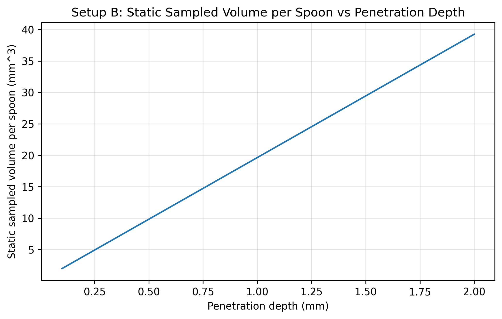
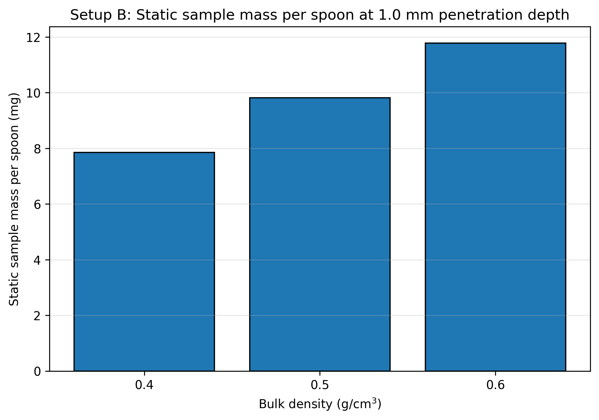
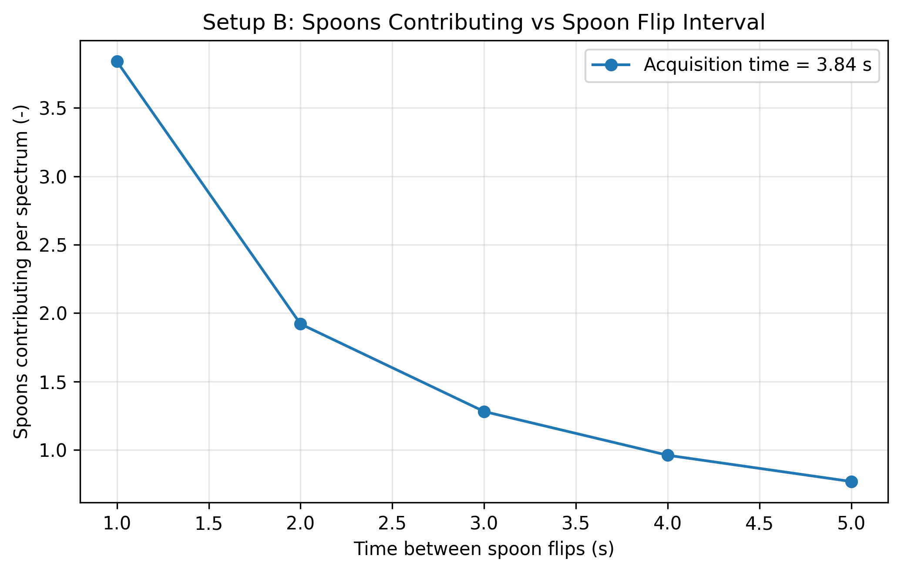
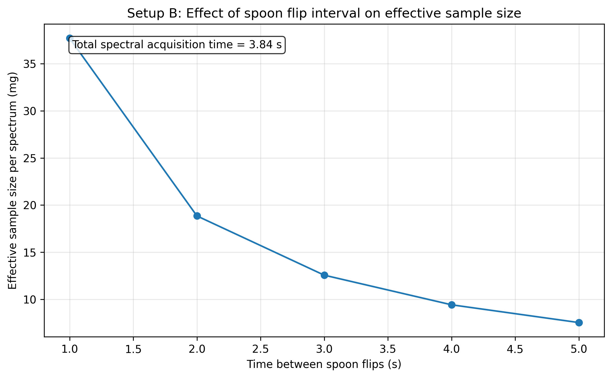
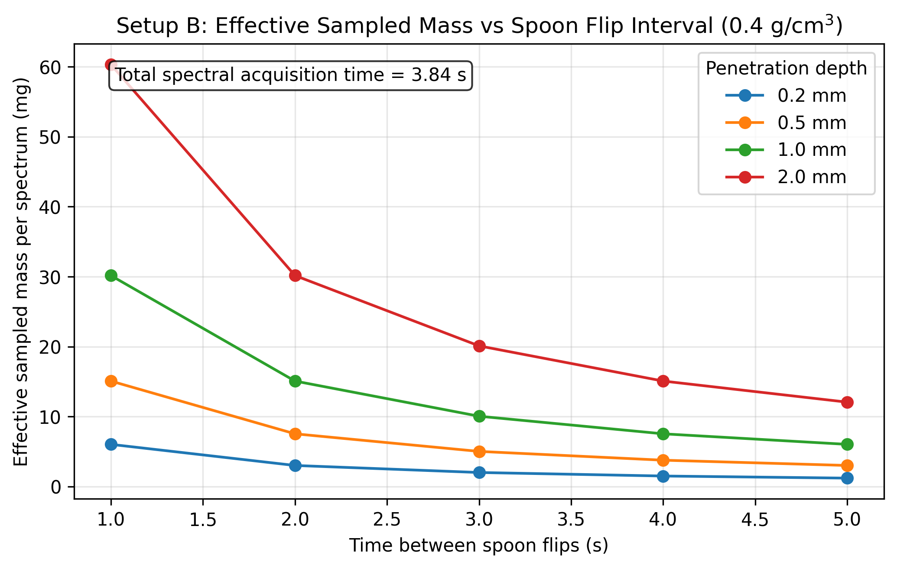

# Setup B Spoon Effective Sample Size Report

Setup: setup_b

Report timestamp: 20260423_083348

Source notebook: setup_B_spoon_effective_sample_size.ipynb

## Executive summary

Setup B is treated as a deterministic sequence of spoon presentations during one spectral acquisition. The report separates the static optical mass sampled by one spoon from the number of spoon presentations that occur during the acquisition window, then combines them into an effective sampled mass per spectrum. The dominant trend is that shorter spoon intervals increase the number of contributing presentations and therefore increase effective sampled mass.

## Key parameters

- Probe diameter (mm): 5
- Penetration depth range (mm): 0.1 to 2.0
- Penetration depth step (mm): 0.1
- Bulk densities (g/cm^3): 0.4, 0.5, 0.6
- Subscans: 256
- Integration time (ms): 15
- Acquisition time (s): 3.84
- Spoon intervals (s): 1, 2, 3, 4, 5

## Background

Setup B represents a spoon or flip-sampler interface where powder originates from a flowing process stream, is captured in a spoon, and is measured by the NIR probe while static during each spoon presentation.

The upstream process is dynamic, but each optical event is treated as a static-bed measurement during the spoon exposure. During one reported spectrum, multiple spoon presentations may occur. Under the assumptions used here, effective sample size is governed by optical interaction mass per spoon, total acquisition time, and spoon flipping frequency. It is not directly governed by upstream throughput in this first deterministic model.
## Objective

This notebook simulates Setup B effective sample size by quantifying:

- static optical sampled mass per spoon
- number of spoon samples contributing during one spectrum
- effective sampled mass per spectrum

as functions of penetration depth, bulk density, flip frequency, and acquisition settings.
## Theory

For one spoon presentation (static measurement):

$$A_{probe} = \pi\left(\frac{D_{probe}}{2}\right)^2$$

$$V_{static} \approx A_{probe}\,d_{pen}$$

$$m_{static} = \rho_{bulk}\,V_{static}$$

Acquisition timing:

$$t_{acq} = N_{subscans}\,t_{int}$$

$$t_{spoon} = \frac{1}{f_{flip}}$$

$$N_{spoons} = t_{acq}\,f_{flip}$$

Effective sampled mass during one reported spectrum:

$$m_{eff} = m_{static}\,N_{spoons}$$

Symbol definitions and units:

- $D_{probe}$: probe diameter [m]
- $A_{probe}$: probe area [m$^2$]
- $d_{pen}$: effective penetration depth [m]
- $\rho_{bulk}$: bulk density [kg/m$^3$]
- $V_{static}$: static sampled volume per spoon [m$^3$]
- $m_{static}$: static sampled mass per spoon [kg]
- $N_{subscans}$: number of averaged sub-scans [-]
- $t_{int}$: integration time per sub-scan [s]
- $t_{acq}$: total acquisition time [s]
- $f_{flip}$: spoon flipping frequency [Hz]
- $t_{spoon}$: spoon interval [s]
- $N_{spoons}$: spoon samples contributing during one acquisition [-]
- $m_{eff}$: effective sampled mass per spectrum [kg]
## Interpretation of the Model

In this setup, one spoon presentation is one independent static optical sample. If acquisition time spans multiple spoon presentations, the reported spectrum integrates multiple independent increments.

In this notebook, $N_{spoons}$ is allowed to be non-integer as a deterministic first approximation for effective mass scaling. Under the stated assumptions, throughput is not explicitly modeled.
## Assumptions

- spoon always completely filled
- filling is reproducible
- consecutive spoons are independent
- powder is static during each spoon measurement
- circular probe window
- cylindrical optical interaction volume approximation
- uniform bulk density
- no resampling within a spoon
- no segregation correction
- no stochastic independence correction
- no detailed radiative transfer model yet
## Worked example

A representative deterministic spoon-presentation case is shown for density 0.4 g/cm^3, penetration depth 1.0 mm, and spoon interval 3.0 s. This makes the multiplicative logic of the model explicit: static sampled mass per spoon times the number of spoon presentations within one acquisition window.

| Quantity | Value | Unit |
| --- | --- | --- |
| Bulk density | 0.4 | g/cm^3 |
| Penetration depth | 1.0 | mm |
| Spoon interval | 3.0 | s |
| Static sampled mass per spoon | 7.8540 | mg |
| Spoons contributing | 1.2800 | - |
| Effective sampled mass per spectrum | 10.0531 | mg |
## Model scenarios and sweep design

The Setup B sweep combines a static optical model for one spoon with a deterministic presentation count over the acquisition window.

- penetration depth from 0.1 to 2.0 mm in 0.1 mm steps
- bulk-density scenarios of 0.4, 0.5, 0.6 g/cm^3
- spoon intervals of 1, 2, 3, 4, 5 s
- acquisition time fixed by 256 subscans at 15.0 ms integration time

This produces 300 modeled scenarios.
## Selected results table

The selected table below focuses on the representative density of 0.4 g/cm^3 and shows how penetration depth and spoon interval jointly affect the final effective sampled mass.

| penetration_depth_mm | spoon_interval_s | spoons_contributing | static_sampled_mass_mg | effective_sampled_mass_mg |
| --- | --- | --- | --- | --- |
| 0.5 | 1.0 | 3.8400 | 3.9270 | 15.0796 |
| 0.5 | 3.0 | 1.2800 | 3.9270 | 5.0265 |
| 0.5 | 5.0 | 0.7680 | 3.9270 | 3.0159 |
| 1.0 | 1.0 | 3.8400 | 7.8540 | 30.1593 |
| 1.0 | 3.0 | 1.2800 | 7.8540 | 10.0531 |
| 1.0 | 5.0 | 0.7680 | 7.8540 | 6.0319 |
| 2.0 | 1.0 | 3.8400 | 15.7080 | 60.3186 |
| 2.0 | 3.0 | 1.2800 | 15.7080 | 20.1062 |
| 2.0 | 5.0 | 0.7680 | 15.7080 | 12.0637 |
## Figures

The figures are ordered from static optical geometry to deterministic presentation count to the final effective sampled-mass response.

## Results Interpretation

- Plot 2 shows static sample mass per spoon for three representative bulk densities: 0.4, 0.5, and 0.6 g/cm$^3$ at a penetration depth of 1.0 mm
- Plot 4 uses only representative bulk density 0.5 g/cm$^3$
- Plot 5 uses representative bulk density 0.4 g/cm$^3$
- Plot 4 x-axis is time between spoon flips (s), not flip frequency (Hz)
- shorter spoon intervals produce more independent spoon presentations during acquisition, increasing effective sample size
## Limitations

- independence between spoons is assumed
- complete and reproducible filling is assumed
- no explicit throughput effect is included
- no dynamic filling physics is modeled
- no partial spoon overlap model is included
- no integer/discrete spoon capture model is enforced
- no optical weighting correction yet
## Appendices

## Next logical extensions

- enforce integer spoon counting or partial spoon weighting
- include incomplete filling scenarios
- include non-independent spoons
- include spoon geometry explicitly
- include particle count estimation
- include uncertainty in penetration depth and bulk density
## Exported artifacts

CSV files

- results_full.csv
- summary_table.csv
- input_summary.csv
- flip_summary.csv
- plot2_static_sample_mass_table.csv
- plot4_spoon_interval_effect_table.csv
- selected_depths_interval_table.csv

Figure files

- plot_01_static_sampled_volume_per_spoon.png
- plot_02_static_sample_mass_per_spoon.png
- plot_03_spoons_contributing_vs_interval.png
- plot_04_effective_sample_size_vs_flip_interval.png
- plot_05_effective_mass_vs_flip_interval_selected_depths.png
