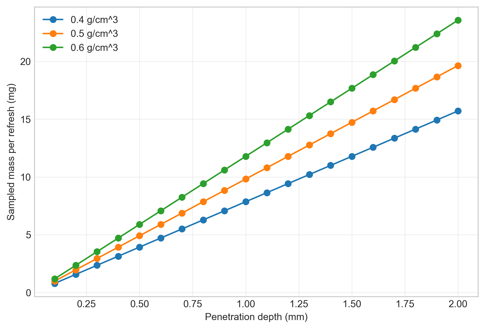
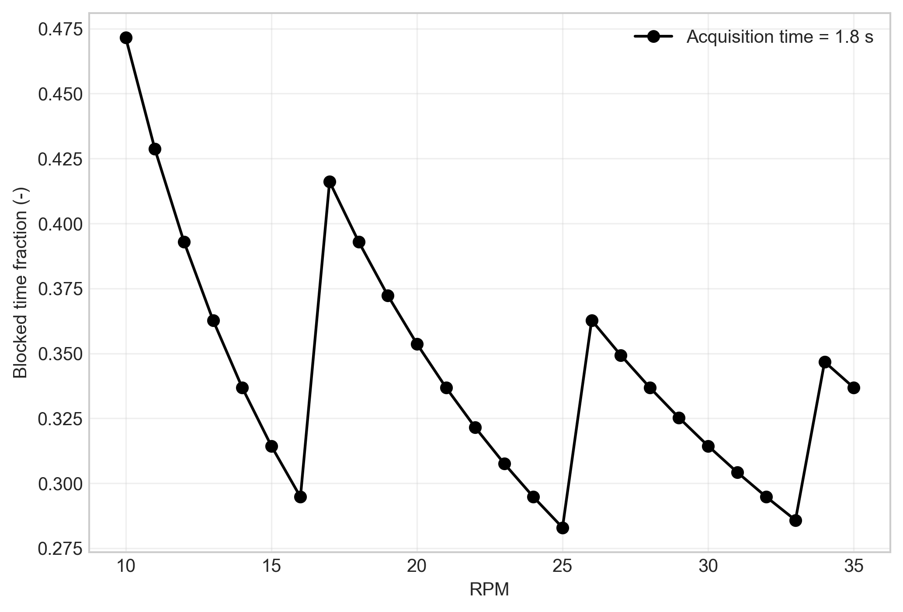
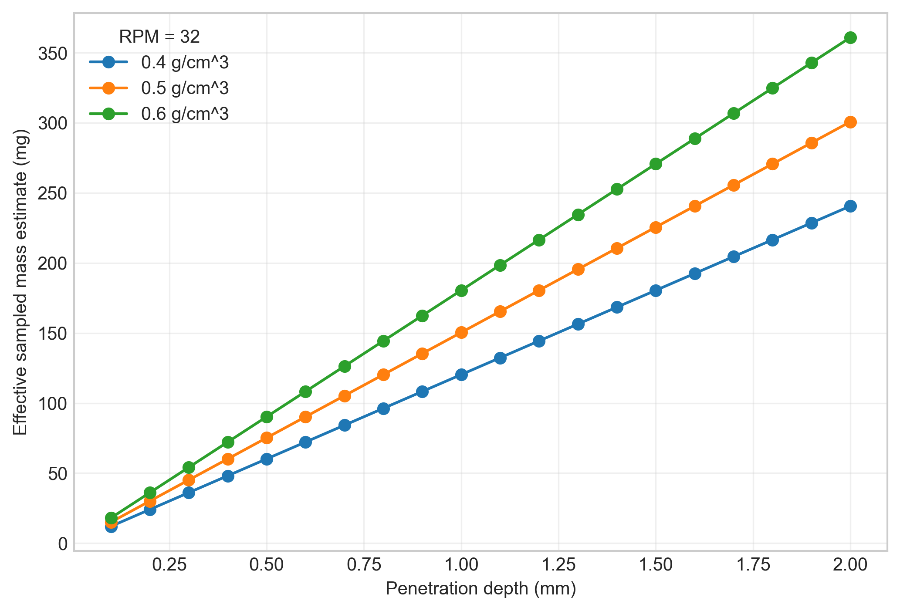
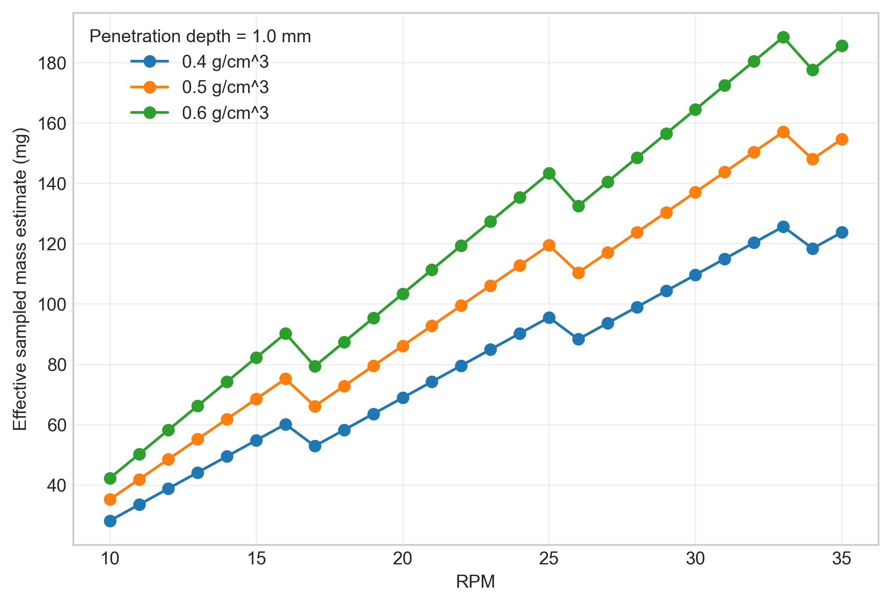
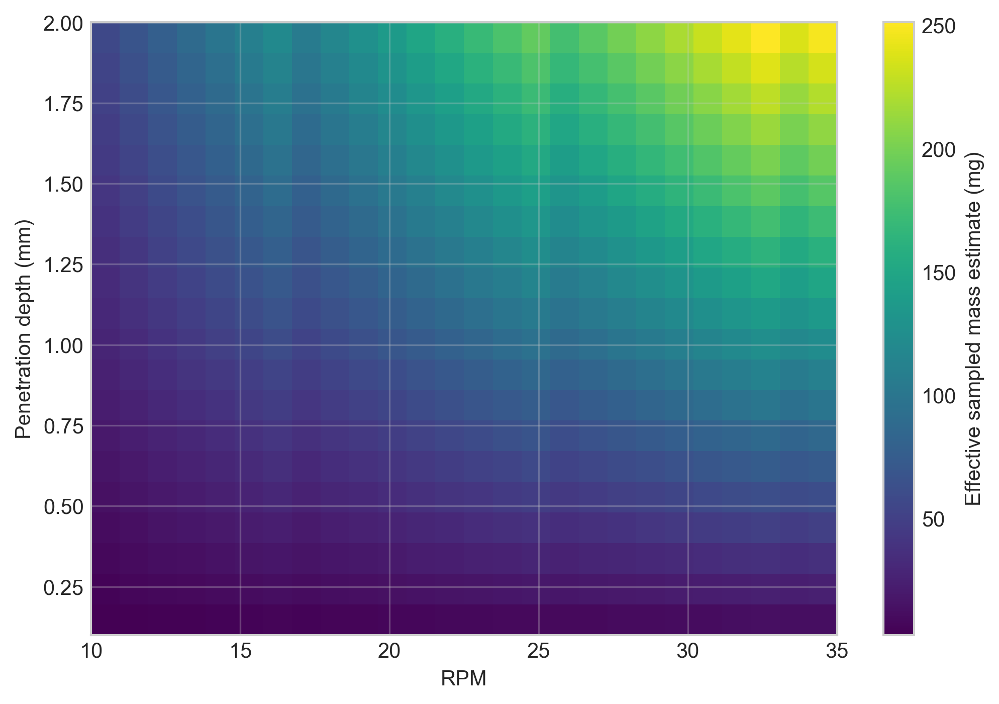
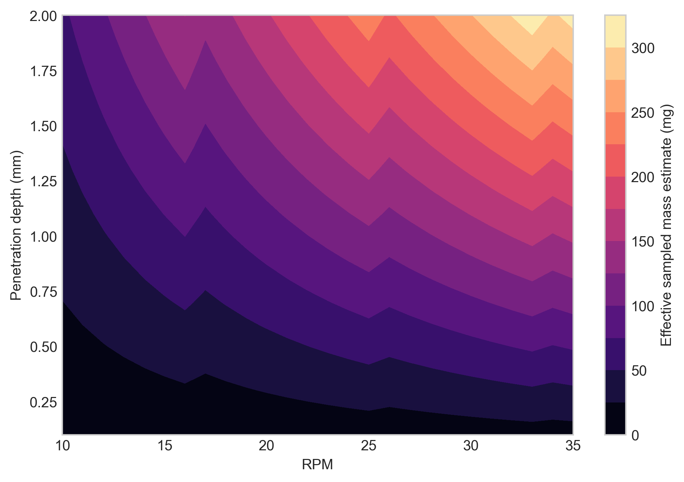

# Setup C Spiderwheel Effective Sample Size Report

Setup: setup_c

Report timestamp: 20260422_115630

Source notebook: setup_C_spiderwheel_effective_sample_size.ipynb

## Executive summary

Setup C treats spiderwheel presentation as a deterministic renewal problem modified by wheel-finger blocking. The report separates sampled mass per refresh event from blocked observation time and deterministic renewal count, then combines them into a first-order effective sampled-mass estimate. The main result is that penetration depth and density scale the per-refresh mass, while RPM changes both renewal rate and blocked-time behavior.

## Key parameters

- Finger count: 4
- Wheel radius (cm): 3
- Probe radial position (cm): 1.8
- Finger width (cm): 0.3
- Probe diameter (mm): 5
- Acquisition time (s): 1.8
- Density scenarios (g/cm^3): 0.4, 0.5, 0.6
- RPM range: 10 to 35
- Penetration depth range (mm): 0.1 to 2.0

## Background

Setup C represents a spiderwheel-driven powder presentation geometry for NIR diffuse reflectance measurement. As in the other notebooks in this series, the interaction region is treated as a shallow near-surface region in front of the probe window, and the sampled mass is approximated from probe footprint, assumed penetration depth, and bulk density.

The key physical difference from Setup B is that Setup B treats each spoon presentation as a static measurement event, whereas Setup C uses wheel motion to actively renew powder at the probe location during a single acquisition. The spiderwheel therefore introduces two competing effects: it can increase the rate at which newly presented powder passes through the probe region, but the fingers can also intermittently block the probe and reduce the usable observation time.

This notebook is therefore positioned as a first-order mechanistic approximation and a deterministic renewal model. It is intended to quantify effective sampled mass trends and blocking trends, not to claim a validated statistical effective sample size or a full radiative-transfer description of the measurement.
## Objective

This notebook estimates, for Setup C:

- sampled mass per refresh event
- blocked and unblocked acquisition time during one spectrum
- number of refresh opportunities during one spectrum
- effective sampled mass estimate per spectrum
- sensitivity of the estimate to penetration depth, bulk density, and wheel RPM
## Theory

Wheel kinematics at the probe position:

$$
\omega = \frac{2\pi \, \mathrm{RPM}}{60}
$$

$$
v = \omega \, r_{\mathrm{pos}}
$$

where $r_{\mathrm{pos}}$ is the radial distance from the wheel center to the probe center (not half of the probe diameter).

First-order footprint and sampled mass per refresh event:

$$
A_{\mathrm{probe}} = \pi \left(\frac{D_{\mathrm{probe}}}{2}\right)^2
$$

$$
V_{\mathrm{sample}} = A_{\mathrm{probe}} \, d_{\mathrm{pen}}
$$

$$
m_{\mathrm{sample}} = \rho_{\mathrm{bulk}} \, V_{\mathrm{sample}}
$$

Characteristic renewal time scale:

$$
t_{\mathrm{cross}} = \frac{D_{\mathrm{probe}}}{v}
$$

This is the time required for a powder segment moving at the local tangential speed $v$ to traverse one probe diameter. It represents the characteristic time scale on which the material in front of the probe is replaced by newly arriving material, and therefore sets the renewal rate.

Binary blocking geometry:

Each spiderwheel finger has a tangential width $w_{\mathrm{finger}}$ at the probe's radial position. At a distance $r_{\mathrm{pos}}$ from the wheel center, the finger and the probe each subtend small angles:

$$
\theta_{\mathrm{finger}} = \frac{w_{\mathrm{finger}}}{r_{\mathrm{pos}}}
\qquad\qquad
\theta_{\mathrm{probe}} = \frac{D_{\mathrm{probe}}}{r_{\mathrm{pos}}}
$$

These are chord-over-radius approximations valid when the widths are small compared to $r_{\mathrm{pos}}$.

Blocking begins when the leading edge of a finger reaches the leading edge of the probe and ends when the trailing edge of the finger clears the trailing edge of the probe. The total overlap angle per finger pass is therefore the sum of both angular widths:

$$
\theta_{\mathrm{overlap}} = \theta_{\mathrm{finger}} + \theta_{\mathrm{probe}}
$$

The time blocked by one finger pass at angular speed $\omega$ is:

$$
t_{\mathrm{block,1}} = \frac{\theta_{\mathrm{overlap}}}{\omega}
$$

The number of individual finger passes during one acquisition is estimated from the rotation rate and the number of fingers:

$$
N_{\mathrm{pass}} = \left\lceil \frac{t_{\mathrm{acq}} \cdot \mathrm{RPM} \cdot n_{\mathrm{fingers}}}{60} \right\rceil
$$

Total blocked time is the sum of all individual blocking events, capped at the acquisition time:

$$
t_{\mathrm{blocked}} = \min\!\left(t_{\mathrm{acq}},\; N_{\mathrm{pass}} \cdot t_{\mathrm{block,1}}\right)
$$

Effective unblocked acquisition time:

$$
t_{\mathrm{eff}} = \max\left(0,\; t_{\mathrm{acq}} - t_{\mathrm{blocked}}\right)
$$

Deterministic renewal count:

$$
N_{\mathrm{refresh}} = \frac{t_{\mathrm{eff}}}{t_{\mathrm{cross}}}
$$

Effective sampled mass estimate during one acquisition:

$$
m_{\mathrm{eff,est}} = m_{\mathrm{sample}} \, N_{\mathrm{refresh}}
$$

Symbol definitions and units:

- $\mathrm{RPM}$: wheel rotation rate [rev min$^{-1}$]
- $\omega$: angular speed [rad s$^{-1}$]
- $r_{\mathrm{pos}}$: radial distance from wheel center to probe center [cm]
- $v$: tangential speed at the probe's radial position [cm s$^{-1}$]
- $D_{\mathrm{probe}}$: probe window diameter [cm] in calculations, reported as [mm] in engineering tables and labels
- $A_{\mathrm{probe}}$: probe footprint area [cm$^2$]
- $d_{\mathrm{pen}}$: assumed penetration depth [cm] in calculations, reported as [mm] in engineering tables and labels
- $V_{\mathrm{sample}}$: sampled volume per refresh event [cm$^3$]
- $\rho_{\mathrm{bulk}}$: bulk density [g cm$^{-3}$]
- $m_{\mathrm{sample}}$: sampled mass per refresh event [g]
- $w_{\mathrm{finger}}$: tangential width of one spiderwheel finger at the probe's radial position [cm]
- $n_{\mathrm{fingers}}$: number of spiderwheel fingers [-]
- $\theta_{\mathrm{finger}}$: angular width of one finger at $r_{\mathrm{pos}}$ [rad]
- $\theta_{\mathrm{probe}}$: angular width of the probe window at $r_{\mathrm{pos}}$ [rad]
- $\theta_{\mathrm{overlap}}$: total overlap angle per finger pass [rad]
- $t_{\mathrm{block,1}}$: time blocked by a single finger pass [s]
- $N_{\mathrm{pass}}$: number of finger passes during one acquisition [-]
- $t_{\mathrm{acq}}$: total spectral acquisition time [s]
- $t_{\mathrm{blocked}}$: total time during which the probe is treated as blocked [s]
- $t_{\mathrm{eff}}$: effective unblocked acquisition time [s]
- $t_{\mathrm{cross}}$: characteristic crossing time for one probe diameter of tangential motion [s]
- $N_{\mathrm{refresh}}$: deterministic renewal count during one acquisition [-]
- $m_{\mathrm{eff,est}}$: effective sampled mass estimate during one acquisition [g]

The code uses mixed practical engineering units for convenience: geometry is entered mainly in cm and mm, density in g/cm$^3$, time in s, and reported masses are often shown in mg. The calculations remain internally consistent because the unit conversions are handled explicitly in the code.
## Interpretation of the Model

In this notebook, a *refresh* means the passage of newly presented powder across the probe region due to wheel motion. It is best interpreted as a renewal opportunity for material presented to the probe window, not as proof of a statistically independent new sample.

Tangential speed is evaluated at the probe's radial position on the wheel ($r_{\mathrm{pos}}$) because the local renewal rate should be tied to the wheel speed where the probe actually views the material. The crossing time $t_{\mathrm{cross}}$ is then interpreted as a characteristic time scale for a wheel-driven material segment to traverse one probe width.

Blocked time is subtracted because the model uses a binary blocking approximation: when a spiderwheel finger overlaps the probe region, the probe is treated as having no usable access to powder during that interval. The resulting $t_{\mathrm{eff}}$ is therefore an effective observation time rather than the full instrument acquisition time.

$N_{\mathrm{refresh}}$ should therefore be interpreted as a deterministic renewal count, rather than a demonstrated count of independent samples. Powder recirculation, revisit probability, local residence-time memory, and correlation between successive refresh events are not modeled. For the same reason, $m_{\mathrm{eff,est}}$ is an effective sampled mass estimate, not yet a validated statistical effective sample size and not a direct estimate of analytical variance.

Despite these simplifications, the model is still useful as a mechanistic engineering tool because it shows how geometry, density, penetration depth, RPM, and blocking assumptions influence the amount of powder that is plausibly renewed in front of the probe during one spectrum.
## Assumptions

- circular probe window with area represented by $A_{\mathrm{probe}}$
- first-order cylindrical sampled volume approximation, $V_{\mathrm{sample}} = A_{\mathrm{probe}} d_{\mathrm{pen}}$
- constant bulk density over the sampled region
- constant assumed penetration depth for each simulation condition
- local renewal rate represented by tangential velocity at the probe's radial position on the wheel ($r_{\mathrm{pos}}$)
- binary blocking behavior when a spiderwheel finger overlaps the probe region
- no partial transmission, partial attenuation, or partial exposure through a finger
- no revisit probability or recirculation correction for previously presented powder
- no depth-wise weighting within the assumed sampling volume
- no stochastic treatment of particle independence or correlation between refresh events
- no explicit radiative-transfer solution
## Single-Case Worked Example

The following worked example evaluates one representative operating condition so that the intermediate quantities can be read directly before the full parameter sweep is run. The sequence is intentionally mechanistic: first the sampled mass per refresh event is estimated, then blocking is estimated, then the effective unblocked acquisition time is obtained, and only then is the effective sampled mass estimate calculated through the deterministic renewal count.
## Worked example summary

The worked example below makes the deterministic bookkeeping explicit: per-refresh sampled mass, blocked time, effective observation time, renewal count, and the final effective sampled-mass estimate are reported separately.

| quantity | value | units |
| --- | --- | --- |
| angular speed | 3.4034 | rad/s |
| probe x | 1.5588 | cm |
| probe y | 0.9000 | cm |
| probe area | 0.1963 | cm^2 |
| sampled volume per refresh | 0.0196 | cm^3 |
| sampled mass per refresh | 7.8540 | mg |
| tangential velocity | 6.1261 | cm/s |
| crossing time | 0.0816 | s |
| blocked time | 0.5224 | s |
| effective acquisition time | 1.2776 | s |
| estimated refresh count | 15.6540 | - |
| effective sampled mass estimate | 122.9461 | mg |
## Parameter Sweep / Simulation

The simulation sweeps bulk density, wheel RPM, and penetration depth while holding the remaining geometry fixed. Each row in the output table represents one deterministic operating condition for the current first-order model.
## Selected results table

The first table highlights representative density-RPM-depth combinations. The second table isolates the blocking side of the model at representative wheel speeds so the reader can separate probe availability from sampled-mass-per-refresh effects.

| density_g_cm3 | rpm | penetration_depth_mm | blocked_time_s | n_refresh | sampled_mass_per_refresh_mg | effective_sampled_mass_estimate_mg |
| --- | --- | --- | --- | --- | --- | --- |
| 0.4000 | 10 | 0.5000 | 0.8488 | 3.5858 | 3.9270 | 14.0816 |
| 0.4000 | 10 | 1.0000 | 0.8488 | 3.5858 | 7.8540 | 28.1631 |
| 0.4000 | 10 | 2.0000 | 0.8488 | 3.5858 | 15.7080 | 56.3262 |
| 0.4000 | 20 | 0.5000 | 0.6366 | 8.7717 | 3.9270 | 34.4463 |
| 0.4000 | 20 | 1.0000 | 0.6366 | 8.7717 | 7.8540 | 68.8926 |
| 0.4000 | 20 | 2.0000 | 0.6366 | 8.7717 | 15.7080 | 137.7852 |
| 0.4000 | 35 | 0.5000 | 0.6063 | 15.7504 | 3.9270 | 61.8518 |
| 0.4000 | 35 | 1.0000 | 0.6063 | 15.7504 | 7.8540 | 123.7037 |
| 0.4000 | 35 | 2.0000 | 0.6063 | 15.7504 | 15.7080 | 247.4073 |
| 0.5000 | 10 | 0.5000 | 0.8488 | 3.5858 | 4.9087 | 17.6020 |
| 0.5000 | 10 | 1.0000 | 0.8488 | 3.5858 | 9.8175 | 35.2039 |
| 0.5000 | 10 | 2.0000 | 0.8488 | 3.5858 | 19.6350 | 70.4078 |
| 0.5000 | 20 | 0.5000 | 0.6366 | 8.7717 | 4.9087 | 43.0579 |
| 0.5000 | 20 | 1.0000 | 0.6366 | 8.7717 | 9.8175 | 86.1158 |
| 0.5000 | 20 | 2.0000 | 0.6366 | 8.7717 | 19.6350 | 172.2315 |
| 0.5000 | 35 | 0.5000 | 0.6063 | 15.7504 | 4.9087 | 77.3148 |
| 0.5000 | 35 | 1.0000 | 0.6063 | 15.7504 | 9.8175 | 154.6296 |
| 0.5000 | 35 | 2.0000 | 0.6063 | 15.7504 | 19.6350 | 309.2592 |
| 0.6000 | 10 | 0.5000 | 0.8488 | 3.5858 | 5.8905 | 21.1223 |
| 0.6000 | 10 | 1.0000 | 0.8488 | 3.5858 | 11.7810 | 42.2447 |
| 0.6000 | 10 | 2.0000 | 0.8488 | 3.5858 | 23.5619 | 84.4894 |
| 0.6000 | 20 | 0.5000 | 0.6366 | 8.7717 | 5.8905 | 51.6695 |
| 0.6000 | 20 | 1.0000 | 0.6366 | 8.7717 | 11.7810 | 103.3389 |
| 0.6000 | 20 | 2.0000 | 0.6366 | 8.7717 | 23.5619 | 206.6778 |
| 0.6000 | 35 | 0.5000 | 0.6063 | 15.7504 | 5.8905 | 92.7778 |
| 0.6000 | 35 | 1.0000 | 0.6063 | 15.7504 | 11.7810 | 185.5555 |
| 0.6000 | 35 | 2.0000 | 0.6063 | 15.7504 | 23.5619 | 371.1110 |

Representative blocking summary

| rpm | blocked_time_s | effective_time_s | n_refresh |
| --- | --- | --- | --- |
| 10 | 0.8488 | 0.9512 | 3.5858 |
| 20 | 0.6366 | 1.1634 | 8.7717 |
| 35 | 0.6063 | 1.1937 | 15.7504 |
## Figures

The figures are ordered from mechanism to response: sampled mass per refresh and blocked-time fraction first, then the accumulated effective sampled-mass estimate as one-dimensional and two-dimensional response maps.

## Results Interpretation

- increasing bulk density increases the sampled mass per refresh event linearly in this simplified volume model and therefore increases the effective sampled mass estimate proportionally when the renewal count is unchanged
- increasing penetration depth increases the assumed sampled volume linearly and therefore increases the per-refresh sampled mass linearly under the current approximation
- increasing RPM decreases the characteristic crossing time and therefore increases the deterministic number of renewal opportunities, all else being equal
- blocking reduces effective observation time and therefore reduces the effective sampled mass estimate relative to an unblocked case
- these outputs are mechanistically useful for engineering comparison, but they do not by themselves establish statistical independence of refresh events or a validated independent effective sample size
## Limitations

- partial blocking, partial transmission, and partial attenuation are not modeled; blocking is treated as binary
- recirculation, revisit probability, and repeated presentation of the same powder increment are not modeled
- particle-scale heterogeneity, segregation, and particle-count statistics are outside the present approximation
- depth-dependent photon weighting is not represented; the sampling region is treated with a uniform first-order volume approximation
- residence-time distributions and local mixing memory near the probe are not modeled
- stochastic independence of refresh events is not modeled, so renewal count is not equivalent to validated independent sample count
- the model does not yet convert effective sampled mass estimate into analytical variance, prediction uncertainty, or a validated statistical effective sample size
## Appendices

## Next Logical Extensions

- replace binary blocking with a partial-blocking or partial-exposure model
- include revisit probability or explicit recirculation of powder around the wheel
- resolve the acquisition in time or phase so that exposure depends on wheel angle during the spectrum
- introduce depth-dependent weighting instead of a uniform cylindrical volume approximation
- estimate particle count as well as mass within the refreshed sampling region
- apply a correlation correction between refresh events before interpreting the result as effective sample mass
- link effective sampled mass estimate to analytical variance or prediction precision
## Exported artifacts

CSV files

- results_full.csv
- summary_table.csv
- blocking_summary.csv
- worked_example.csv

Figure files

- plot_01_estimate_vs_penetration_depth.png
- plot_02_estimate_vs_rpm.png
- plot_03_heatmap_density_05.png
- plot_04_blocked_time_fraction_vs_rpm.png
- plot_05_sampled_mass_per_refresh.png
- plot_06_contour_density_06.png
