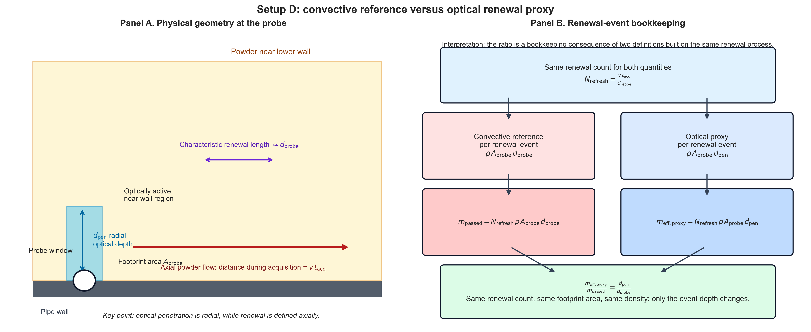
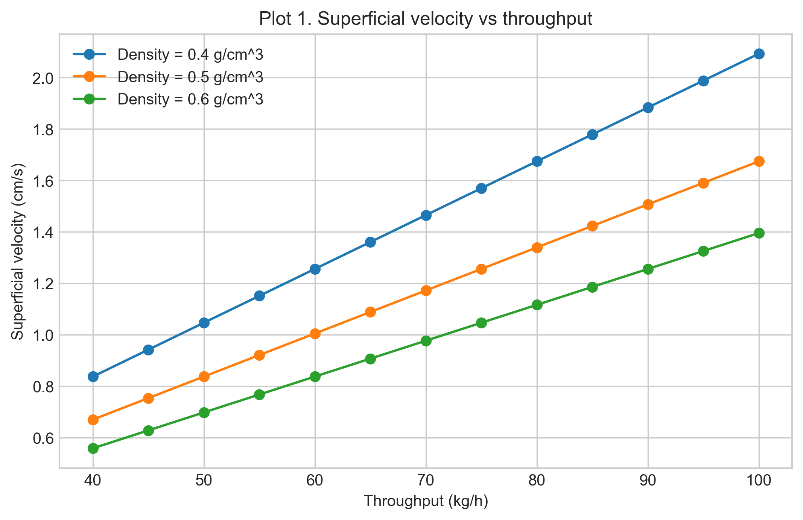
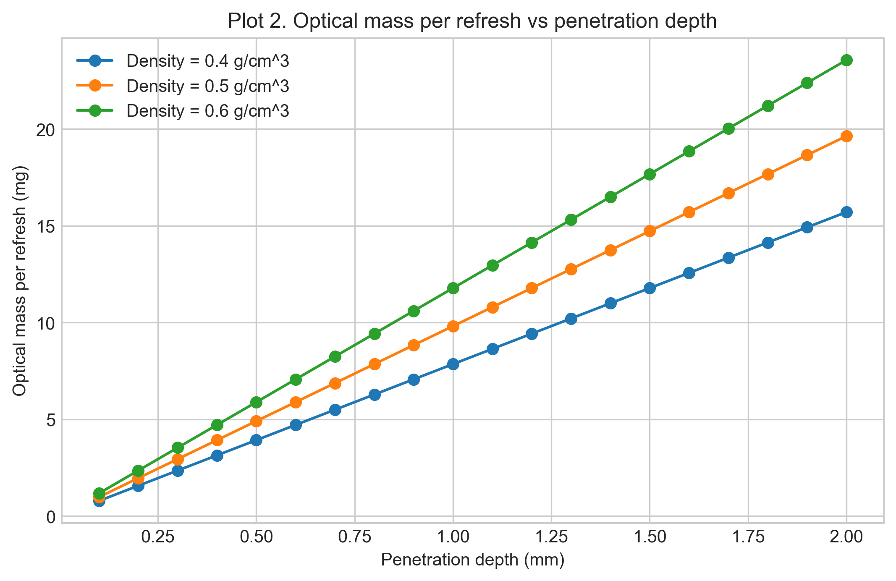
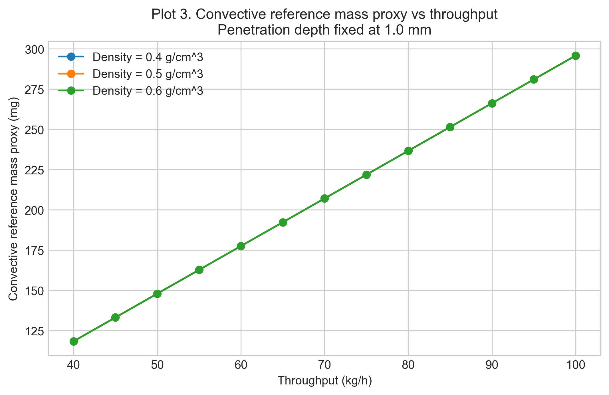
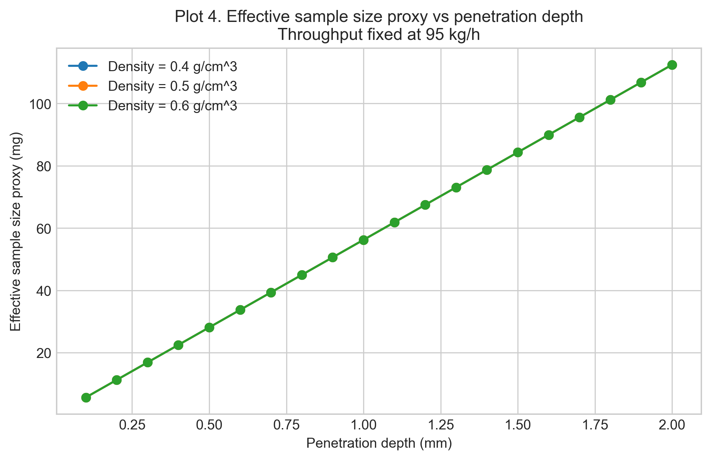
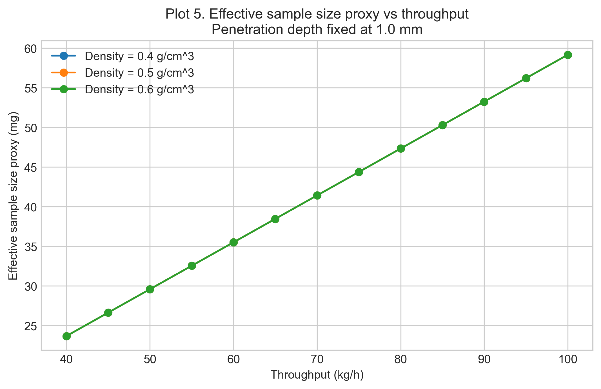
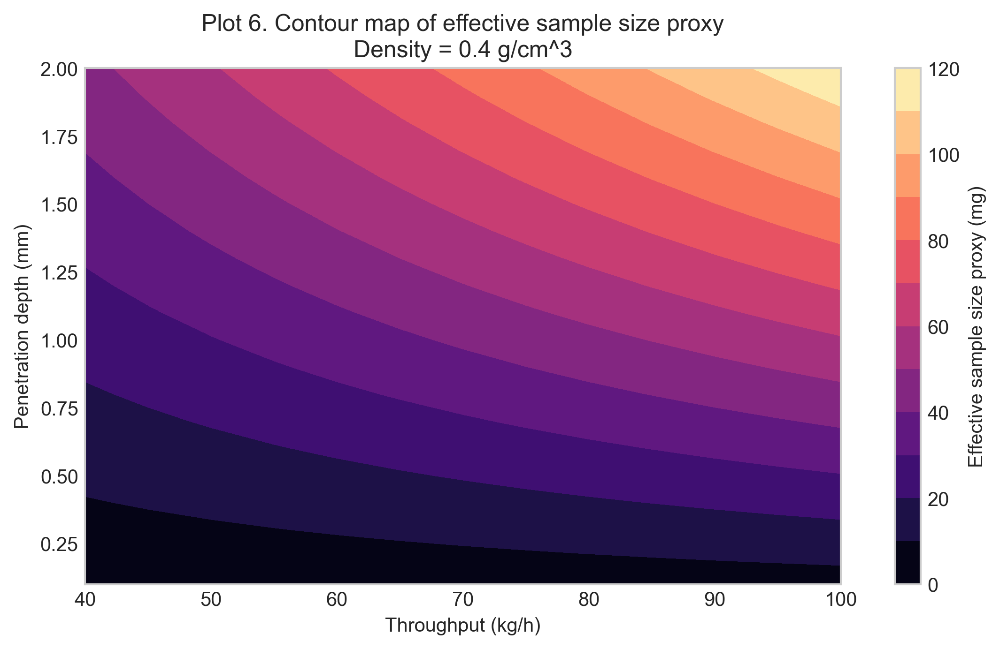

# Setup D Powder Flow and Effective Sample Size Proxy Report

Setup: setup_d

Report timestamp: 20260422_115522

Source notebook: setup_D_pipe_effective_sample_size.ipynb

## Executive summary

Setup D is assessed as a first-order renewal-driven NIR sampling problem in an inclined powder pipe. The report separates transport-side powder presentation from optical reduction at the probe and uses that framework to estimate a refresh-based proxy effective mass during one 1.8 s acquisition. The results show that throughput and penetration depth increase the proxy, while density cancels at fixed throughput within the present superficial-velocity formulation.

## Key parameters

- Pipe diameter (mm): 65
- Pipe tilt from vertical (deg): 26.5
- Pipe total height (mm): 340
- Inlet-outlet displacement (mm): 100.2
- Probe diameter (mm): 5
- Acquisition time (s): 1.8
- Throughput range (kg/h): 40 to 100
- Density scenarios (g/cm^3): 0.4, 0.5, 0.6
- Penetration depth range (mm): 0.1 to 2.0

## Background

Setup D represents an inclined powder-pipe geometry with a wall-mounted diffuse-reflectance NIR probe near the lower side of the pipe. Unlike the static bed in Setup A, the spoon presentations in Setup B, or the wheel-driven renewal in Setup C, this setup treats renewal as a flow-driven process in which fresh powder slides axially past a fixed probe during one acquisition.

The notebook uses a first-order engineering proxy to connect transport-side renewal with optical penetration depth. The reported quantity is a refresh-based proxy effective mass, intended for comparative sensitivity analysis and design-stage interpretation rather than as a validated independent sample mass.
## Objective

This notebook estimates, for Setup D:

- superficial-velocity-driven renewal at the probe
- optical mass per renewal event as a function of penetration depth and bulk density
- a convective reference mass-presentation proxy during one acquisition
- a refresh-based effective sample size proxy as a function of throughput and penetration depth
- whether density remains in the final proxy once the superficial-velocity relation is applied
## Theory

### Optical sampling concept

In diffuse reflectance NIR measurements, light enters a powder bed, interacts with particles over a limited depth, and a fraction of the scattered light returns to the detector. The measured spectrum therefore reflects an **optically weighted near-surface region** rather than the entire bulk stream.

For engineering comparisons, the instantaneous optical interaction region is approximated here as a simple cylinder with:

- cross-sectional area equal to the probe footprint
- depth equal to an assumed optical penetration depth

This simplification ignores depth-dependent photon weighting, scattering anisotropy, packing-dependent path-length effects, and spectral absorption details, but it provides a transparent basis for comparative analysis.

### Probe-flow geometry

In Setup D, the probe is mounted in the pipe wall and looks **radially inward**. The powder flows **axially** along the pipe. These directions are perpendicular.

At any instant, the probe sees a shallow optical disc of powder pressed against the wall:

- the disc face is the **probe footprint** with diameter $d_{\mathrm{probe}}$
- the disc depth is the **optical penetration depth** $d_{\mathrm{pen}}$ extending radially into the powder

Because the probe looks perpendicular to the flow, renewal occurs by material sliding **across** the probe window rather than being pushed **into** it. The flow supplies fresh material axially, while the light samples radially.

### Why a renewal model is appropriate

During one acquisition, the probe does not observe a single static neighborhood of powder. Instead, moving material repeatedly replaces the near-wall region in front of the probe. A renewal model is therefore a natural first-order way to connect powder motion to the mass that can contribute to one spectrum.

### Why superficial velocity is still useful

The notebook uses a **superficial bulk velocity** to estimate the renewal driver from throughput, bulk density, and full pipe cross-sectional area. This is a deliberate engineering approximation: the local wall velocity may differ from the cross-sectional average, but the superficial velocity still provides a transparent transport-side baseline for sensitivity analysis and model comparison.
## Interpretation of the Model

Setup D is treated as an inclined internal-flow geometry with fixed hardware and operating conditions. The probe is flush with the lower pipe wall and looks radially inward, while powder moves axially downward through the pipe and is expected to slide preferentially along the lower side.

For the modeled operating window, the engineering picture is more consistent with **slow dense-phase sliding** than with dilute pneumatic transport. In practical terms, that means:

- the lower wall is likely to remain covered under normal operating throughputs
- the near-wall material may be denser and slower than the cross-sectional average
- mild consolidation near the wall is plausible
- intermittent exposure could occur toward the low-throughput edge but is not included in the base model

The base model therefore uses superficial velocity only as a **first-order renewal driver**. That makes the notebook useful for comparative assessment, but it also means the proxy may overestimate the local renewal rate if the wall-adjacent powder moves more slowly than the bulk average.

Within this notebook, the reported output should be read as a **refresh-based proxy effective mass** rather than as a validated statistical effective sample size. The model is intended to separate transport-side presentation from optical reduction at the probe, not to resolve detailed flow profiles, repeated presentation, or full radiative-transfer behavior.
## Assumptions

The base model is intentionally simple. Its assumptions are grouped below so the reader can see exactly where the engineering approximation enters the calculation.

### Optical and geometric assumptions

- the instantaneous optical sampling region is approximated as a cylinder with volume $A_{\mathrm{probe}} \cdot d_{\mathrm{pen}}$
- the probe window is fully covered by powder at all times
- the probe footprint remains the relevant lateral scale for both the optical proxy and the renewal approximation

### Transport and renewal assumptions

- powder renewal at the probe is approximated by a **first-order renewal approximation** with characteristic axial length of order $d_{\mathrm{probe}}$
- the renewal rate is derived from a **bulk superficial velocity** computed from throughput, density, and full pipe cross-sectional area
- no explicit blocking events or recirculation corrections are included

### Flow-state assumptions

- bulk density is constant and spatially uniform within each scenario
- the powder at the probe is assumed to be in a dense-phase, gravity-driven sliding regime rather than an aerated or fluidized state
- de-aeration during transit through the pipe is assumed but not explicitly modeled
- velocity profiles across the pipe cross-section are not resolved; the superficial velocity represents a bulk average
- local wall velocity may differ from the average superficial velocity, but that difference is ignored in the base model

### Interpretation boundary

- the output is a **refresh-based proxy effective mass** intended for comparative engineering analysis, not a validated independent sample mass

These assumptions intentionally favor transparency and internal consistency over full optical or granular-flow realism.
## Input Parameters

Baseline geometry, acquisition settings, sweep ranges, and worked-example values are defined below. Engineering units are kept in the parameter block and labels for readability, while internal calculations use consistent cm, g, s, and mg conventions.

The parameterization covers:

- pipe geometry and probe diameter
- acquisition time
- throughput range from 40 to 100 kg/h
- density scenarios of 0.4, 0.5, and 0.6 g/cm^3
- penetration depth range from 0.1 to 2.0 mm
- one representative worked example at 95 kg/h, 0.4 g/cm^3, and 1.0 mm penetration depth
## Governing Equations and Proxy Definitions

Internal units used throughout the simulation are:

- geometry in **cm**
- area in **cm^2**
- volume in **cm^3**
- time in **s**
- density in **g/cm^3**
- throughput entered in **kg/h** and converted internally to **g/s**
- penetration depth entered in **mm** and converted internally to **cm**
- final reported proxy effective sample masses in **mg**

### Geometric directions at the probe

The probe is mounted in the pipe wall, looking **radially inward**. The powder flows **axially** past the probe. The model uses three perpendicular directions:

| Direction | Symbol | Physical meaning |
|---|---|---|
| **Axial** (along flow) | $v \cdot t_{\mathrm{acq}}$ | distance powder travels during acquisition |
| **Tangential** (in the wall plane) | $d_{\mathrm{probe}}$ | probe footprint width |
| **Radial** (into powder) | $d_{\mathrm{pen}}$ | light penetration depth from wall into powder |

At any single instant, the probe sees a shallow optical disc of powder with face area $A_{\mathrm{probe}}$ and radial depth $d_{\mathrm{pen}}$. Over a finite acquisition, the model does **not** claim that the sampled material is an exact geometric sweep or an exact union. Instead, it uses a **first-order renewal approximation** in which the near-wall powder in front of the probe is refreshed over a characteristic axial length of order $d_{\mathrm{probe}}$.

### Pipe and flow quantities

Pipe cross-sectional area:

$$
A_{\mathrm{pipe}} = \pi \left(\frac{d_{\mathrm{pipe}}}{2}\right)^2
$$

Mass flow conversion:

$$
\dot{m}_{\mathrm{g/s}} = \dot{m}_{\mathrm{kg/h}} \cdot \frac{1000}{3600}
$$

Superficial velocity (axial direction):

$$
v = \frac{\dot{m}}{\rho \cdot A_{\mathrm{pipe}}}
$$

Units: $[\mathrm{g/s}] / ([\mathrm{g/cm^3}] [\mathrm{cm^2}]) = [\mathrm{cm/s}]$.

This is the cross-sectional average axial velocity of the powder along the pipe. In this notebook it is used only as a first-order renewal driver.

**Worked-example check** ($\dot{m} = 95\;\mathrm{kg/h}$, $\rho = 0.4\;\mathrm{g/cm^3}$, $d_{\mathrm{pipe}} = 65\;\mathrm{mm}$):

| Step | Value | Unit |
|---|---|---|
| $\dot{m}$ | $95 \times 1000 / 3600 = 26.3889$ | g/s |
| $A_{\mathrm{pipe}}$ | $\pi (6.5/2)^2 = 33.1831$ | cm^2 |
| $\rho \cdot A_{\mathrm{pipe}}$ | $0.4 \times 33.1831 = 13.2732$ | g/cm |
| $v = \dot{m} / (\rho \cdot A_{\mathrm{pipe}})$ | $26.3889 / 13.2732 = 1.9882$ | cm/s |

### Instantaneous optical mass

Probe footprint area:

$$
A_{\mathrm{probe}} = \pi \left(\frac{d_{\mathrm{probe}}}{2}\right)^2
$$

Instantaneous optical mass:

$$
m_{\mathrm{opt}} = \rho \cdot A_{\mathrm{probe}} \cdot d_{\mathrm{pen}}
$$

This is the instantaneous optically weighted mass adjacent to the probe under the cylindrical optical-volume approximation.

### Refresh factor

The first-order renewal approximation assumes that the powder in front of the probe is refreshed when material advances by a characteristic axial length of order $d_{\mathrm{probe}}$. The corresponding refresh factor during one acquisition is:

$$
N_{\mathrm{refresh}} = \frac{v \cdot t_{\mathrm{acq}}}{d_{\mathrm{probe}}}
$$

This is a renewal-based proxy, not an exact count of independent packets of powder.

### Proxy effective sample mass

The proxy effective sample mass is defined as:

$$
m_{\mathrm{eff,proxy}} = m_{\mathrm{opt}} \cdot N_{\mathrm{refresh}}
$$

Combining the expressions gives:

$$
m_{\mathrm{eff,proxy}} = \rho \cdot A_{\mathrm{probe}} \cdot d_{\mathrm{pen}} \cdot \left(\frac{v \cdot t_{\mathrm{acq}}}{d_{\mathrm{probe}}}\right)
$$

Interpretation of this expression:

- it is a **first-order mechanistic proxy model**
- it assumes renewal of powder over a characteristic length scale of order $d_{\mathrm{probe}}$
- it is **not** the exact geometric union of sampled material
- it is intended for **comparative engineering analysis**

### Convective reference mass-flow proxy

The convective reference mass-flow proxy is a bookkeeping reference quantity: it asks how much powder is presented past the probe footprint during one acquisition under the same superficial-velocity model used elsewhere in the notebook. It ignores optical penetration depth and should **not** be read as an exact 3D sampled volume or an exact geometric union of illuminated powder.

Using the superficial velocity and footprint area defined above,

$$
m_{\mathrm{passed}} = \rho \cdot v \cdot A_{\mathrm{probe}} \cdot t_{\mathrm{acq}}
$$

This is the turnover mass associated with successive probe-footprint-scale neighborhoods being renewed past the probe during one acquisition, under the first-order superficial-velocity model.

**Key assumptions:**

1. The powder is a continuous, uniform stream (no gaps, no clumps).
2. Every bit of powder counted by this turnover reference is included, regardless of whether the light actually reaches it.
3. The speed is the bulk average; powder near the wall might actually move slower.

#### Relation to the effective sample size proxy

The convective reference counts the full footprint-scale mass associated with the renewal process. The optical proxy counts only the shallow optically active mass within that same renewal process:

$$
m_{\mathrm{eff,proxy}} = m_{\mathrm{passed}} \cdot \frac{d_{\mathrm{pen}}}{d_{\mathrm{probe}}}
$$

#### Renewal-event interpretation of the ratio

The factor $d_{\mathrm{pen}} / d_{\mathrm{probe}}$ should **not** be read as the light penetrating partway through one common slab of thickness $d_{\mathrm{probe}}$. In this model it is the ratio of two proxy masses assigned to the **same renewal event** at the probe.

The shared renewal count is:

$$
N_{\mathrm{refresh}} = \frac{v \cdot t_{\mathrm{acq}}}{d_{\mathrm{probe}}}
$$

For one renewal event, the convective reference counts

$$
m_{\mathrm{event,passed}} = \rho \cdot A_{\mathrm{probe}} \cdot d_{\mathrm{probe}}
$$

while the optical proxy counts

$$
m_{\mathrm{event,optical}} = \rho \cdot A_{\mathrm{probe}} \cdot d_{\mathrm{pen}}
$$

Multiplying both by the same renewal count gives

$$
m_{\mathrm{passed}} = N_{\mathrm{refresh}} \cdot \rho \cdot A_{\mathrm{probe}} \cdot d_{\mathrm{probe}}
$$

$$
m_{\mathrm{eff,proxy}} = N_{\mathrm{refresh}} \cdot \rho \cdot A_{\mathrm{probe}} \cdot d_{\mathrm{pen}}
$$

so that

$$
\frac{m_{\mathrm{eff,proxy}}}{m_{\mathrm{passed}}} = \frac{d_{\mathrm{pen}}}{d_{\mathrm{probe}}}
$$

The two quantities share the same $\rho$, $A_{\mathrm{probe}}$, and $N_{\mathrm{refresh}}$. The only substituted length is the characteristic depth assigned to one renewal event.

#### Cross-directional meaning of the ratio

The ratio compares a **radial optical depth** to an **axial renewal length**:

- **axial** motion sets the renewal count
- **tangential** extent contributes to the footprint area $A_{\mathrm{probe}}$
- **radial** extent sets the optical mass counted within each renewal event

The ratio works because the model compares two bookkeeping definitions built on the same renewal process, not because the light literally penetrates a fraction of the way through an axial slab. The schematic below makes that distinction explicit.

#### Why $d_{\mathrm{probe}}$ appears in the denominator

The denominator is $d_{\mathrm{probe}}$ because the renewal count is defined at the **probe-footprint scale**:

$$
N_{\mathrm{refresh}} = \frac{v \cdot t_{\mathrm{acq}}}{d_{\mathrm{probe}}}
$$

The model asks how many probe-sized renewal events occur during one acquisition, not how many pipe-diameter-length events occur.

#### Numerical check with worked example

Using the worked example ($d_{\mathrm{pen}} = 1\;\mathrm{mm}$, $d_{\mathrm{probe}} = 5\;\mathrm{mm}$):

$$
\frac{d_{\mathrm{pen}}}{d_{\mathrm{probe}}} = \frac{1}{5} = 0.2
$$

So, for each renewal event, the optical proxy counts one-fifth of the mass counted by the convective reference because it uses $d_{\mathrm{pen}}$ instead of $d_{\mathrm{probe}}$.

#### Summary of the three related quantities

| Quantity | What it answers | Formula |
|---|---|---|
| $v$ | How fast is the powder moving? | $\dot{m} / (\rho \cdot A_{\mathrm{pipe}})$ |
| $m_{\mathrm{passed}}$ | How much powder is presented past the probe footprint under the convective reference model? | $\rho \cdot v \cdot A_{\mathrm{probe}} \cdot t_{\mathrm{acq}}$ |
| $m_{\mathrm{eff,proxy}}$ | How much mass is counted by the optical renewal proxy? | $m_{\mathrm{passed}} \cdot d_{\mathrm{pen}} / d_{\mathrm{probe}}$ |

The ratio $d_{\mathrm{pen}} / d_{\mathrm{probe}}$ is therefore a bookkeeping consequence of the proxy model. Its value is to keep the convective reference and the optical proxy conceptually separate.

### Density cancellation within this model

The superficial velocity relation is:

$$
v = \frac{\dot{m}}{\rho \cdot A_{\mathrm{pipe}}}
$$

Substituting into the proxy effective-mass expression gives:

$$
m_{\mathrm{eff,proxy}} = \rho \cdot A_{\mathrm{probe}} \cdot d_{\mathrm{pen}} \cdot \left(\frac{v \cdot t_{\mathrm{acq}}}{d_{\mathrm{probe}}}\right)
$$

$$
m_{\mathrm{eff,proxy}} = \left(\frac{A_{\mathrm{probe}} \cdot d_{\mathrm{pen}} \cdot t_{\mathrm{acq}}}{d_{\mathrm{probe}} \cdot A_{\mathrm{pipe}}}\right) \cdot \dot{m}
$$

In this model, the density terms cancel exactly. That cancellation is **model-dependent**: it follows from using the same bulk density in both the instantaneous optical mass and the superficial-velocity approximation.

This cancellation is worth understanding because it is one of the sharpest internal consistency checks in the notebook. At fixed mass throughput, increasing density does two equal and opposite things within this formulation: it increases the instantaneous optical mass, but it decreases the renewal rate by the same factor through the superficial-velocity relation. If a reader misses that cancellation, they will misread the model and attribute density sensitivity to a proxy that, by construction, does not contain it. Seeing the cancellation tells you exactly what the current model captures, and exactly which additional physics would need to be added before density could matter again.
## Worked example

The worked example provides a numerical anchor for the later sweep. It shows the magnitude of the transport-side turnover mass, the optical mass per renewal event, and the resulting proxy effective mass at one representative operating point.

| Quantity | Value | Unit |
| --- | --- | --- |
| Throughput | 95.0 | kg/h |
| Density | 0.4 | g/cm^3 |
| Superficial velocity | 1.3952 | cm/s |
| Instantaneous optical mass | 7.8540 | mg |
| Refresh factor | 7.1573 | - |
| Convective reference mass-flow proxy | 295.8580 | mg |
| Effective sample size proxy | 56.2130 | mg |
## Parameter Sweep / Simulation

The sweep is designed to separate the transport driver, the optical contribution per renewal event, and the combined proxy response.

- throughput from 40 to 100 kg/h
- density scenarios of 0.4, 0.5, and 0.6 g/cm^3
- penetration depth from 0.1 to 2.0 mm in 0.1 mm steps
- fixed 5 mm probe diameter and 1.8 s acquisition time

This produces 780 modeled scenarios.
## Interpretation of Simulation Table

The selected table below samples low, mid, and high throughput together with representative penetration depths. Full scenario tables are exported separately as CSV files.

| throughput_kg_h | density_g_cm3 | penetration_depth_mm | superficial_velocity_cm_s | optical_mass_per_refresh_mg | n_refresh | effective_sample_mass_proxy_mg | convective_reference_mass_proxy_mg |
| --- | --- | --- | --- | --- | --- | --- | --- |
| 40 | 0.4 | 0.5 | 0.8371 | 3.9270 | 3.0136 | 11.8343 | 118.3432 |
| 40 | 0.4 | 1.0 | 0.8371 | 7.8540 | 3.0136 | 23.6686 | 118.3432 |
| 40 | 0.4 | 2.0 | 0.8371 | 15.7080 | 3.0136 | 47.3373 | 118.3432 |
| 70 | 0.4 | 0.5 | 1.4649 | 3.9270 | 5.2738 | 20.7101 | 207.1006 |
| 70 | 0.4 | 1.0 | 1.4649 | 7.8540 | 5.2738 | 41.4201 | 207.1006 |
| 70 | 0.4 | 2.0 | 1.4649 | 15.7080 | 5.2738 | 82.8402 | 207.1006 |
| 100 | 0.4 | 0.5 | 2.0928 | 3.9270 | 7.5340 | 29.5858 | 295.8580 |
| 100 | 0.4 | 1.0 | 2.0928 | 7.8540 | 7.5340 | 59.1716 | 295.8580 |
| 100 | 0.4 | 2.0 | 2.0928 | 15.7080 | 7.5340 | 118.3432 | 295.8580 |
| 40 | 0.5 | 0.5 | 0.6697 | 4.9087 | 2.4109 | 11.8343 | 118.3432 |
| 40 | 0.5 | 1.0 | 0.6697 | 9.8175 | 2.4109 | 23.6686 | 118.3432 |
| 40 | 0.5 | 2.0 | 0.6697 | 19.6350 | 2.4109 | 47.3373 | 118.3432 |
| 70 | 0.5 | 0.5 | 1.1719 | 4.9087 | 4.2190 | 20.7101 | 207.1006 |
| 70 | 0.5 | 1.0 | 1.1719 | 9.8175 | 4.2190 | 41.4201 | 207.1006 |
| 70 | 0.5 | 2.0 | 1.1719 | 19.6350 | 4.2190 | 82.8402 | 207.1006 |
| 100 | 0.5 | 0.5 | 1.6742 | 4.9087 | 6.0272 | 29.5858 | 295.8580 |
| 100 | 0.5 | 1.0 | 1.6742 | 9.8175 | 6.0272 | 59.1716 | 295.8580 |
| 100 | 0.5 | 2.0 | 1.6742 | 19.6350 | 6.0272 | 118.3432 | 295.8580 |
| 40 | 0.6 | 0.5 | 0.5581 | 5.8905 | 2.0091 | 11.8343 | 118.3432 |
| 40 | 0.6 | 1.0 | 0.5581 | 11.7810 | 2.0091 | 23.6686 | 118.3432 |
| 40 | 0.6 | 2.0 | 0.5581 | 23.5619 | 2.0091 | 47.3373 | 118.3432 |
| 70 | 0.6 | 0.5 | 0.9766 | 5.8905 | 3.5158 | 20.7101 | 207.1006 |
| 70 | 0.6 | 1.0 | 0.9766 | 11.7810 | 3.5158 | 41.4201 | 207.1006 |
| 70 | 0.6 | 2.0 | 0.9766 | 23.5619 | 3.5158 | 82.8402 | 207.1006 |
| 100 | 0.6 | 0.5 | 1.3952 | 5.8905 | 5.0226 | 29.5858 | 295.8580 |
| 100 | 0.6 | 1.0 | 1.3952 | 11.7810 | 5.0226 | 59.1716 | 295.8580 |
| 100 | 0.6 | 2.0 | 1.3952 | 23.5619 | 5.0226 | 118.3432 | 295.8580 |
## Figures

Figures are embedded in mechanism-to-outcome order. The schematic establishes the geometry and renewal-event bookkeeping; the next plots isolate the transport and optical drivers; the remaining plots show the resulting proxy response.

## Results Interpretation

The reordered figures are meant to be read as a causal chain from transport to optical sampling to the final proxy response.

1. **Transport driver.** Plot 1 shows that superficial velocity increases with throughput and decreases with density for fixed mass throughput.
2. **Optical contribution per renewal event.** Plot 2 shows that deeper penetration and higher density increase the instantaneous optical mass associated with one renewal event.
3. **Transport-side reference mass.** Plot 3 shows the convective reference mass-flow proxy. Within the present formulation it scales with throughput and is density independent because the same $\rho$ that raises mass per volume also lowers superficial velocity.
4. **Combined proxy response.** Plots 4 and 5 show that the effective sample size proxy increases with both penetration depth and throughput.
5. **Two-dimensional summary.** Plot 6 compresses the joint dependence on throughput and penetration depth into one representative response surface.

### Why density cancels within this model

In this model, density enters in two places that act in opposite directions.

**Effect 1: more mass in the instantaneous optical region.** A denser powder packs more mass into the same optical cylinder in front of the probe:

$$
m_{\mathrm{opt}} = \rho \cdot A_{\mathrm{probe}} \cdot d_{\mathrm{pen}}
$$

**Effect 2: lower superficial velocity and fewer refreshes.** For fixed mass throughput, a denser powder needs less volumetric flow, so the superficial velocity decreases:

$$
v = \frac{\dot{m}}{\rho \cdot A_{\mathrm{pipe}}}
$$

The proxy effective mass combines those two effects:

$$
m_{\mathrm{eff,proxy}} = \rho \cdot A_{\mathrm{probe}} \cdot d_{\mathrm{pen}} \cdot \left(\frac{v \cdot t_{\mathrm{acq}}}{d_{\mathrm{probe}}}\right)
$$

Substituting $v = \dot{m}/(\rho \cdot A_{\mathrm{pipe}})$ gives:

$$
m_{\mathrm{eff,proxy}} = \left(\frac{A_{\mathrm{probe}} \cdot d_{\mathrm{pen}} \cdot t_{\mathrm{acq}}}{d_{\mathrm{probe}} \cdot A_{\mathrm{pipe}}}\right) \cdot \dot{m}
$$

Within this model, the density terms cancel exactly. That cancellation is **model-dependent**, not a universal physical law. It is one of the most useful internal consistency checks in the notebook: if density still appeared in the final proxy at fixed throughput, the present formulation would not be algebraically self-consistent.

Density would re-enter if any of the following effects were modeled explicitly:

- nonuniform velocity profiles or wall-local velocity corrections
- partial filling or changes in flowing cross-sectional area
- consolidation or compaction near the wall
- repeated presentation of the same powder to the probe
- changes in optical path-length distribution with packing state
## Limitations

Important limitations of this assessment are:

- no velocity-profile resolution across the pipe cross-section
- no explicit local lower-wall velocity correction
- no residence-time distribution model
- possible re-sampling of the same powder is not resolved
- no optical path-length distribution or radiative-transfer model
- no explicit wall slip, compaction, or segregation correction
- the 26.5 degree tilt is represented only qualitatively in the base model
- no intermittent coverage or slug-flow correction at low throughput
- no direct link to analytical variance or Gy sampling theory

These limitations matter most when interpreting the **absolute magnitude** of the reported proxy. The notebook is strongest as a relative engineering comparison across throughput, density, and penetration-depth scenarios.
## Next Logical Extensions

Natural next steps for extending the current Setup D model are:

- introduce a local lower-wall velocity correction instead of using only the bulk superficial velocity
- add partial-fill or intermittent-coverage behavior at the low-throughput edge
- include residence-time or revisit effects so repeated presentation of the same powder can be estimated
- extend the optical model beyond a uniform cylindrical penetration-depth approximation
- compare the proxy predictions against experimental measurements from the inclined-pipe setup

These extensions would determine which parts of the current density cancellation remain and which additional physics reintroduce density sensitivity into the final proxy.
## Appendices

## Glossary of Variables and Symbols

The table below summarizes the variables used in the governing equations.

| Symbol | Name | Definition | Units |
|---|---|---|---|
| $m_{\mathrm{eff,proxy}}$ | Effective sample size proxy | Refresh-based proxy effective mass during one acquisition. | g internally; mg reported |
| $m_{\mathrm{opt}}$ | Instantaneous optical mass | Optical mass associated with the probe footprint and penetration depth at one instant. | g internally; mg reported |
| $N_{\mathrm{refresh}}$ | Refresh factor | Number of characteristic probe-length renewals during one acquisition. | dimensionless |
| $\dot{m}$ | Mass throughput | Bulk powder mass flow rate through the pipe. | kg/h input; g/s internally |
| $\rho$ | Bulk density | Assumed bulk density of the powder in a given scenario. | g/cm^3 |
| $v$ | Superficial velocity | Cross-sectional average axial velocity used as the renewal driver. | cm/s |
| $A_{\mathrm{probe}}$ | Probe footprint area | Circular area of the probe window in the wall plane. | cm^2 |
| $A_{\mathrm{pipe}}$ | Pipe cross-sectional area | Internal cross-sectional area of the pipe. | cm^2 |
| $d_{\mathrm{probe}}$ | Probe diameter | Diameter of the circular probe window. | mm input; cm internally |
| $d_{\mathrm{pipe}}$ | Pipe diameter | Internal diameter of the pipe. | mm input; cm internally |
| $d_{\mathrm{pen}}$ | Penetration depth | Assumed radial optical penetration depth into the powder. | mm input; cm internally |
| $t_{\mathrm{acq}}$ | Acquisition time | Spectrum acquisition time for one measurement. | s |
## Exported artifacts

CSV files

- results_full.csv
- summary_table.csv
- velocity_summary.csv

Figure files

- schematic_probe_geometry_and_bookkeeping.png
- plot_01_superficial_velocity_vs_throughput.png
- plot_02_optical_mass_per_refresh_vs_penetration_depth.png
- plot_03_convective_reference_mass_proxy_vs_throughput.png
- plot_04_effective_sample_size_proxy_vs_penetration_depth.png
- plot_05_effective_sample_size_proxy_vs_throughput.png
- plot_06_contour_effective_sample_size_proxy_density_04.png
